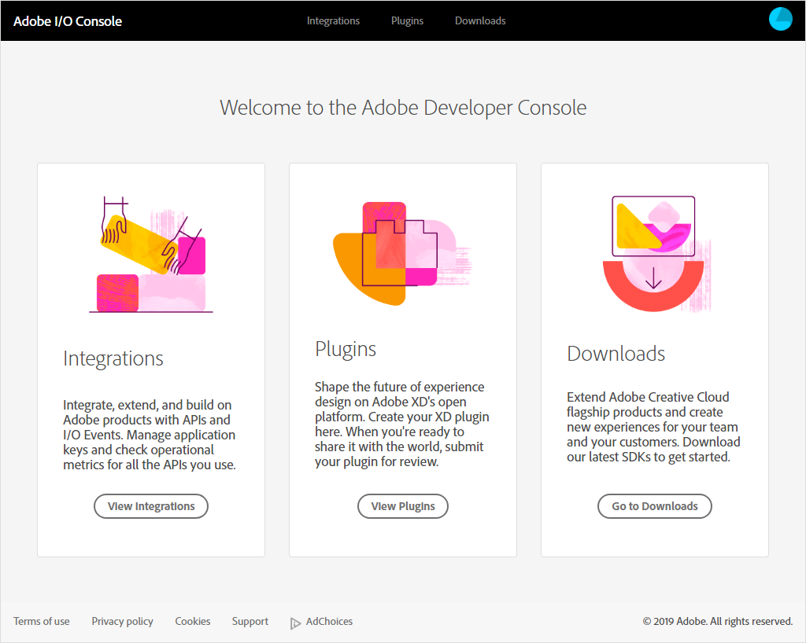

# Adobe I/O Console Developer's Guide
Adobe I/O Console is the the developer's tool for managing the relationship betwwen their applications and Adobe technology. Through the Console, developers can create and manage projects that communicate and collaborate with Adobe:

- [Integrations](integrations.md): Applications you create that leverage the power of Adobe products and technologies through the publicly accessible Adobe REST API.
- Plugins: Applications you create that enhance the functionality of Adobe products and are accessed through the UI of those products. These are typically available through the Adobe Marketplace.
- Downloads: SDKs from Adobe products and technologies, with which you can develop integrations and plugins.

This Guide show you how to use the Adobe I/O Console to create and register integrations and submit plugins for consideration in the Adobe Marketplace.

