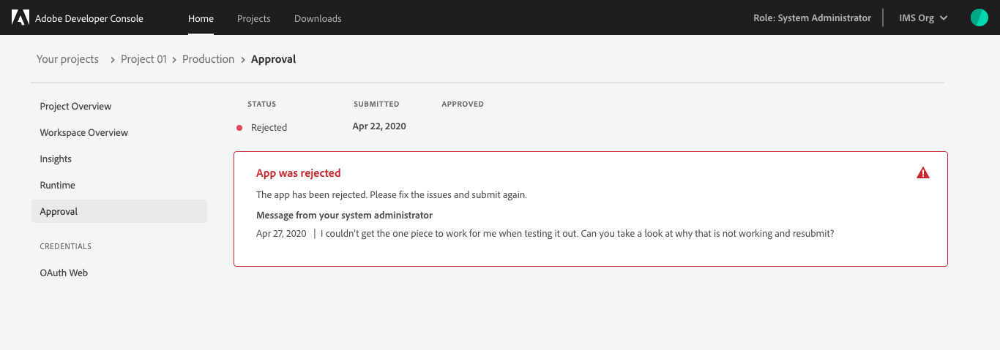
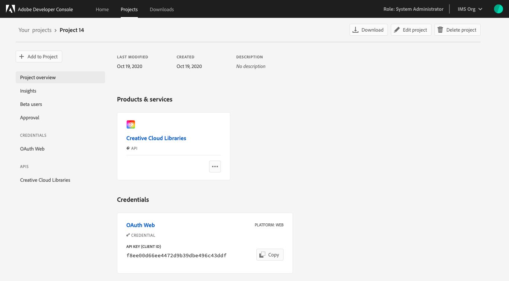
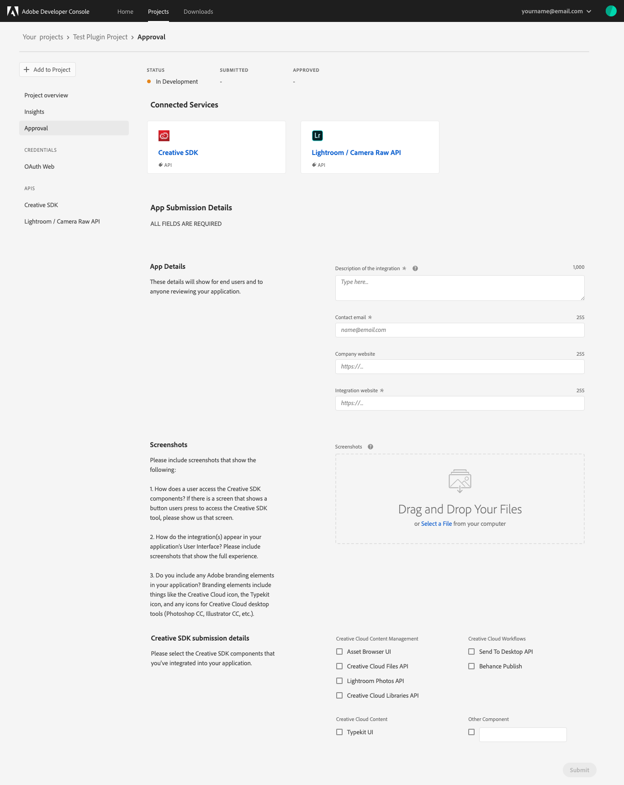
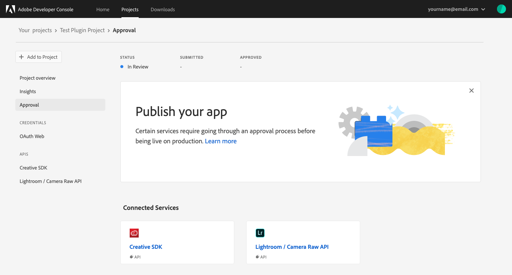

# Project approvals

Once you have completed development on your project, your application is ready for approval. 

There are three different approval processes within Adobe Developer Console, depending on the type of application that you have built:

1. **Project Firefly applications:** Projects built using the Project Firefly template are built by an organization for use within that organization. Therefore, Firefly applications require approvals by the enterprise organization administrator only. 
    
    Please follow the approval process for [Project Firefly applications](#project-firefly-applications) outlined in this document.

2. **Applications for publication:** Building an application for distribution to general users on the Adobe Exchange requires approval from the Adobe Review team before it can be published.

    Please refer to the [applications for publication](#applications-for-publication) approval process outlined in this document.

3. **XD Plugin distribution:** Currently only available as personal projects, XD plugins must be submitted for review and approval before they can be published to the Adobe XD Plugin Marketplace. 

    For detailed instructions on how to submit an XD plugin for approval, follow the steps provided in the [XD plugin distribution guide](plugin-distribution.md).

## Project Firefly applications approval process

Once you have completed development on a Project Firefly application, it is time to submit the application to your administrators for review and approval.

The final app is based on the *Production* workspace, therefore it is important to ensure that the production workspace contains all of the necessary APIs, Events, and Runtime code that it needs before submitting for approval.

To begin the approval process, navigate to the *Production* workspace and select **Submit for approval** in the top-right corner of the console or select **Approval** in the left navigation.

On the *Approval* screen you will be presented with the **App Submission Details** form. These details will be visible to people using your app and administrators reviewing your application.

Once the submission details have been completed, select **Submit** to begin the approval process.

You will be returned to the *Approval* screen, where the *Status* of your application should now be "In Review".

Following a review by your organization administrators, your application will either be approved and published or rejected. If the application is rejected, your admin will be able to include a note telling you what went wrong, allowing you to fix the error and submit for approval again.

If your application is approved, you are ready to move on to the [next steps](#next-steps) found at the end of this document.

## Applications for publication

In order for an application to be available for public users, it must first be approved by the Adobe Review team. To begin, navigate to the *Project overview* for the project containing the application that you wish to publish.

Select **Approval** from the left navigation to view the **App Submission Details**. These details include information about the application that will be shown to end users and the Adobe Review team.

Once the submission details have been completed, select **Submit** to begin the approval process.

At that time your application *Status* will be updated to "In Review" and the **App Submission Details** that you filled in previously will be visible, however they will be greyed out and you will be unable to edit them. 

## Next steps

Once an application has been approved, either by internal reviewers or the Adobe Review team, its *Status* will be updated to "Published" and the application will be available for use either by employees within your enterprise organization (for Project Firefly applications) or for the general public through Adobe Exchange.

