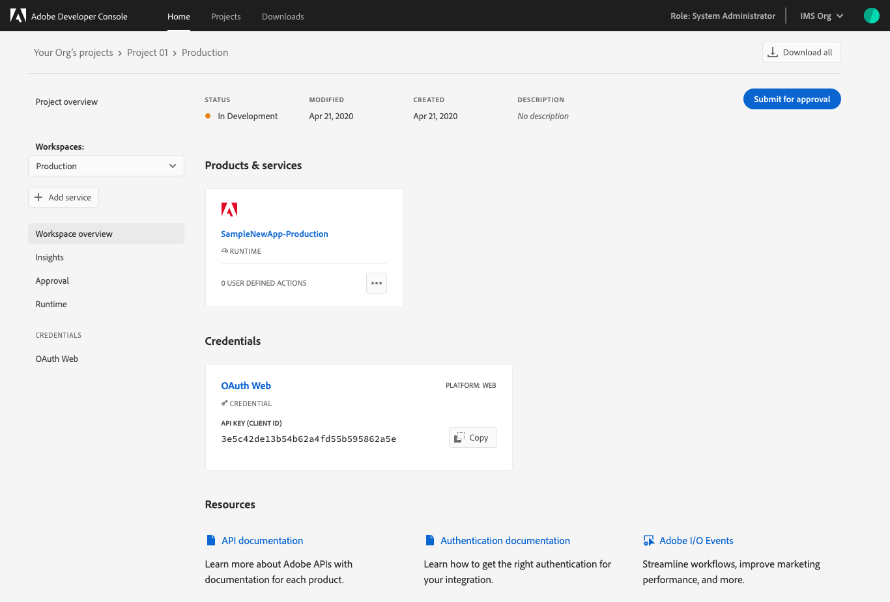
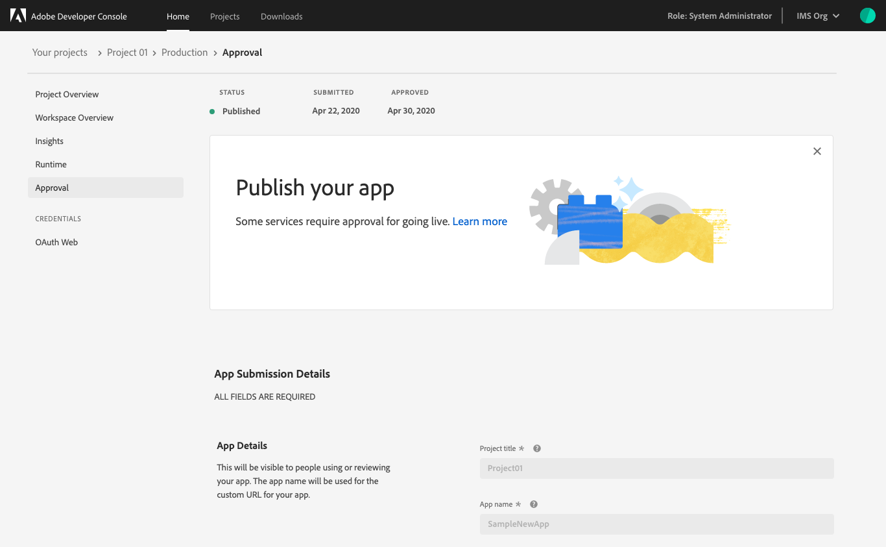

# Project approval process

Once you have completed development on your project, your application is ready for approval. Not all apps require approval by your organizations administrators.

Relies on Production environment - that is the workspace that will be submitted. 

Production workspace drives the status for the overall project

Built your apps, each developer built in their own workspace, when ready to publish to production, make sure production workspaces has API, Events and Runtime code that it needs and submit it for approval.

Project - Production workspace - 

Fill in the app details - project title and app name from initial setup

Description - this will be

Status of the project overall - in development, in review, approved, etc.

Project title and app name from set-up screen
Description - public facing, part of application
Contact - Company administrators know who to go back to

Note to reviewer - internal reviewer in the org.

Project Firefly, initial release will be organization admin approving it first.

Project Firefly, specifically, go to company administrator for approval.

Rejected, see a note why it was rejected

Or approved and published.

