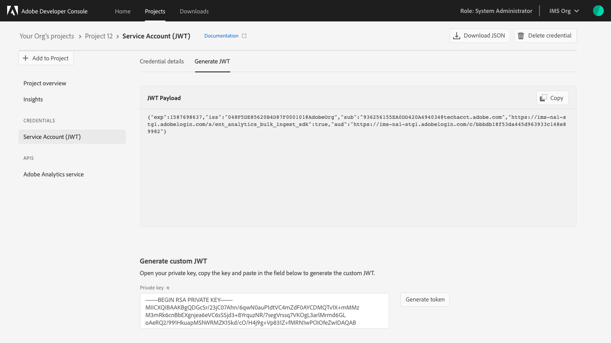
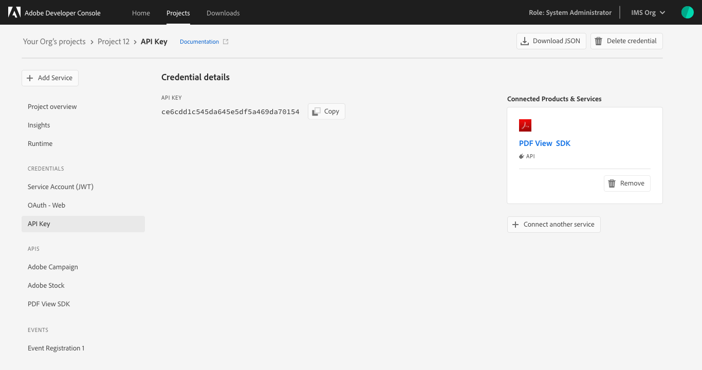

# Credentials overview

Once you have successfully added APIs to your project or workspace, you can return to the *Project overview* (or *Workspace overview* in a templated project) at any time to view the details for that API and any other project services you may have added. 

> **Note:** To view credentials for events, select the specific event registration from the left navigation and then select the *Credentials* tab. For more information on working with events, including viewing event credentials, follow the [guide for adding events to a project](services-add-events.md).

You can select the specific API from the left navigation to view its details or remove the API using the **Remove API** button in the top-right corner.

You can also select the specific credential type from the left navigation to view the *Credential details* and perform other actions (generate JWT tokens, copy credential details, retrieve client secrets, etc.) as needed. 

