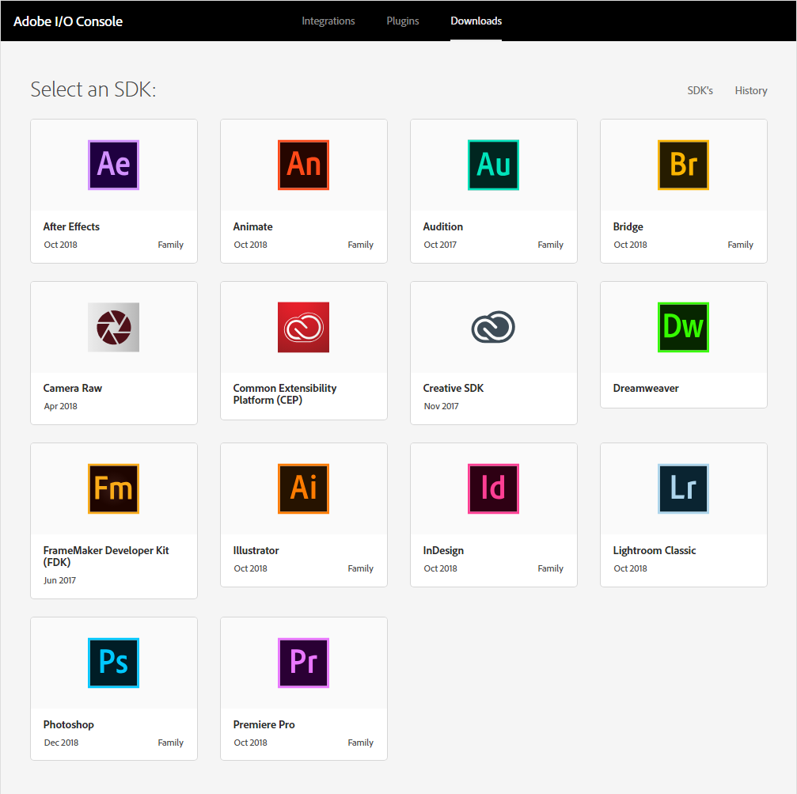
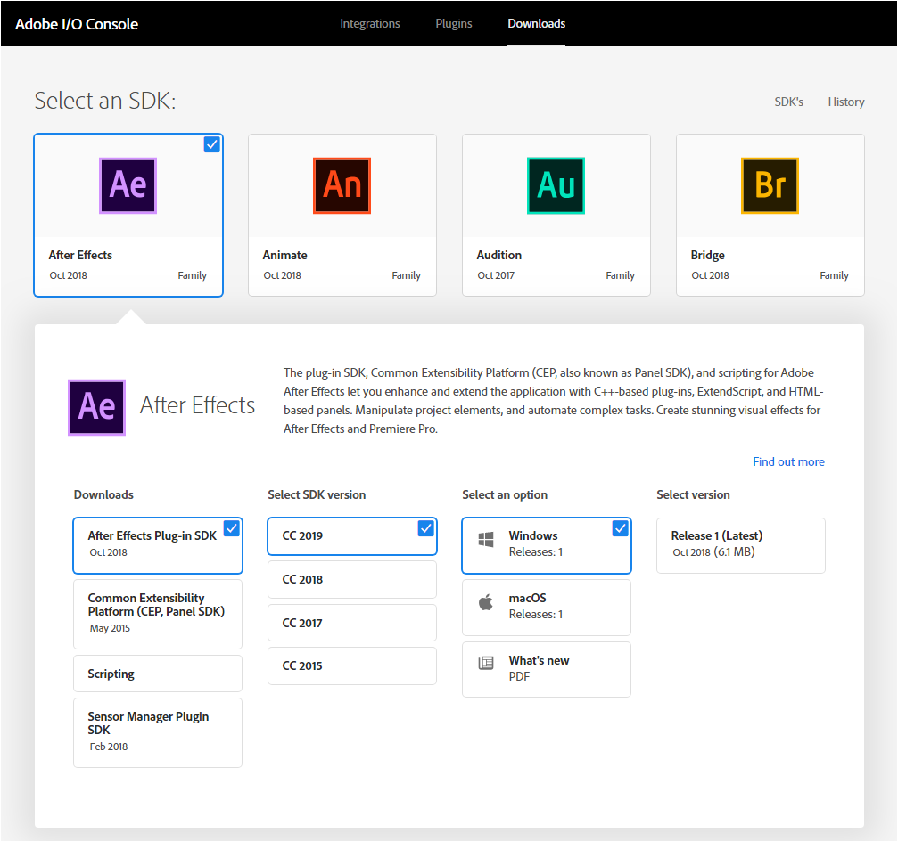

# Adobe I/O Console Downloads

Adobe I/O Console gives you access to the SDKs for many of Adobe's most powerful and popular products and technologies. Through Console, you can download SDKs, get supporting information, find the GitHub repositories for them, and track your download history. 

Select any of the products or technologies you see to access its SDKs and other info:

