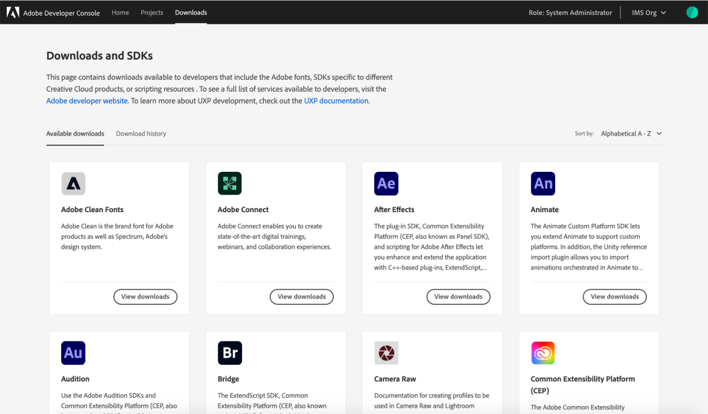
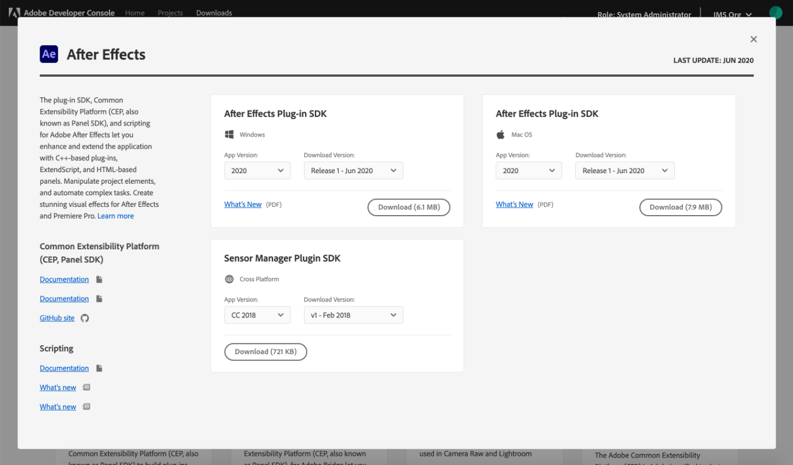
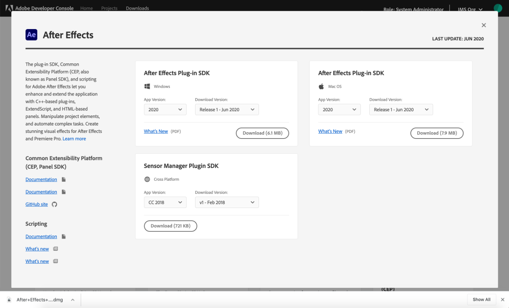
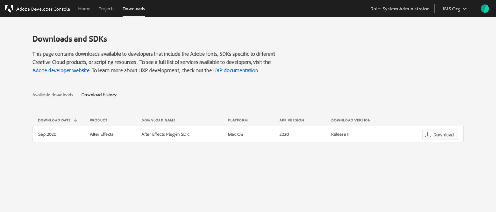

# Adobe Developer Console Downloads

Adobe Developer Console provides access to SDKs for many of Adobe's most powerful and popular products and technologies. Through Console, you can download SDKs, find supporting information related to specific SDKs (such as GitHub repositories), and track your download history. 

## Select an SDK

The **Downloads** page provides an **Available downloads** tab which provides a list of all downloads available to developers including Adobe fonts, SDKs specific to different Creative Cloud products, and scripting resources. As new SDKs become available, the **Available downloads** tab is updated automatically. 

To see a full list of services available to developers, visit the [Adobe developer website](https://www.adobe.io/). 

To choose an SDK, select **View downloads** on one of the product or technology cards. This opens a dialog showing the details for the SDK, including a brief description, links to documentation (where available), configuration details, and the last updated date for the SDK.

Select the appropriate operating system (where applicable), as well as the App Version and Download Version from the options provided in the dropdowns. Note that the possible configuration values vary by SDK.

After selecting the configuration that meets your needs, select **Download** to begin downloading the SDK. The appropriate files for the specific SDK will begin to download automatically.

## SDK history

The **Downloads** page also provides a **Download history** tab where you can view a list of product SDKs that you have downloaded, as well as information related to the SDK configuration and the date of download.

