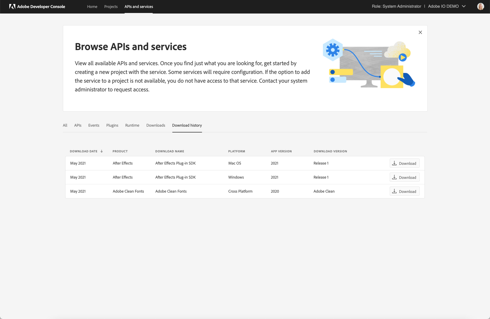

# Adobe Developer Console Downloads

Adobe Developer Console gives you access to the SDKs for many of Adobe's most powerful and popular products and technologies. Through Console, you can download SDKs, get supporting information (such as GitHub repositories) related to specific SDKs, as well as track your download history. 

## Select an SDK

The *Downloads* tab shows a listing of available SDKs for Adobe products and technologies. As new SDKs become available, the list is automatically updated.

When you select one of the product or technology cards, details regarding that SDK appear, including a brief description, links to documentation (where available), and configuration details.

To begin using an SDK, select the appropriate values from the options provided in order to configure the SDK for your needs. Note that the possible configuration values vary by SDK.

Once you have finished configuring the SDK, you will need to review the Terms & Conditions before you can start using it. After reading the terms and conditions, select **I Agree** if you agree and wish to use the SDK.

After agreeing, the appropriate files for the specific SDK will begin to download automatically.

## SDK history

Also within the *Downloads* tab, you can view the *History* of SDKs that you have downloaded, as well as information related to the SDK configuration and the date of download.

