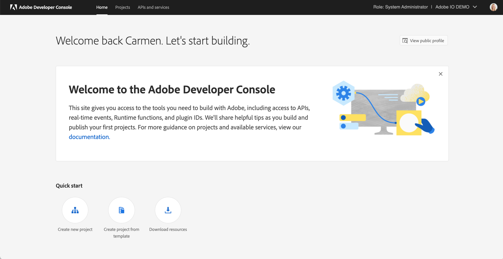
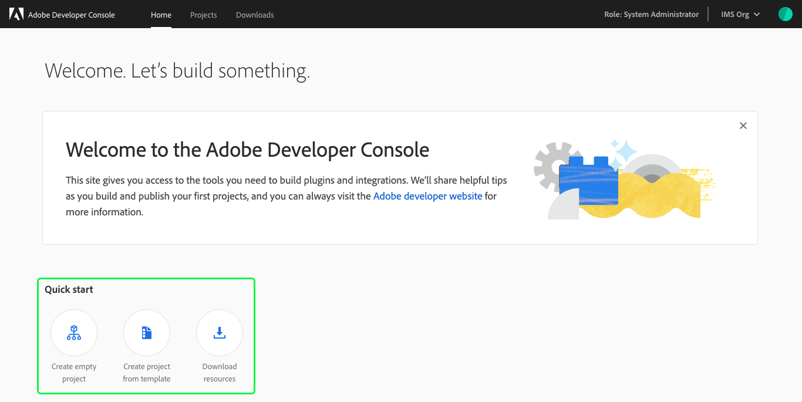
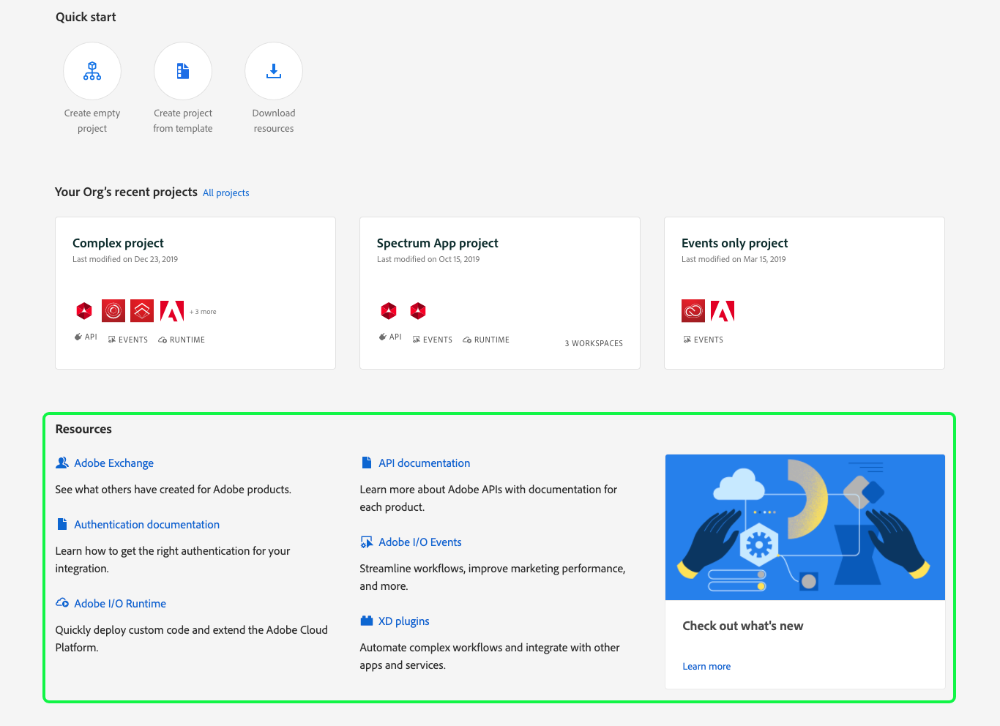
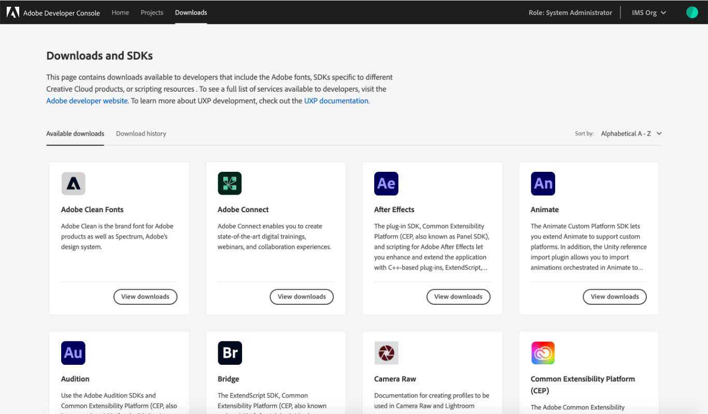

# Getting started with Adobe Developer Console

In order to begin creating projects quickly and easily, this overview document introduces key areas of the Adobe Developer Console user interface (UI), broken down by tab:

* [Home](#home)
* [Projects](#projects)
* [Downloads](#downloads) 

## Home

After successfully logging in to [Adobe Developer Console](https://www.adobe.com/go/devs_console_ui), you arrive at the **Home** screen. This is where you can find quick start links to create a project or download resources, view and edit your public profile, and access the **Projects** and **Downloads** screens using the top navigation.

### Switch Organizations

Adobe Developer Console allows developers to access and work on projects within multiple enterprise organizations as well as create projects within their own developer organization. 

Navigating between organizations is easily done using the organization switcher ("org switcher") located in the top-right corner of the UI. To switch organizations, select the down arrow ( &#709; ) and choose the organization you wish to use.

> **Note:** The "Role" will also update to reflect your role within the newly selected organization.

### Quick start

The home screen also provides "quick start" links to help you get started with some of the most common Console actions. Quick start links are available for: creating a new project, creating a project using a template, and downloading resources.

### Recent projects

Your organization's most recent projects are displayed on the home screen, enabling you to easily continue working or see work that has been done.

The three most recent projects are shown, but to view additional projects for your organization, select **All projects** or choose **Projects** in the top navigation. See the [Projects](#projects) section that follows for more information.

### Resources

The **Resources** section provides helpful links to related documentation, guides, and services to support you in your work.

The resources that appear are influenced by where you are in your workflow, updating to ensure you are provided with the most relevant information at the most appropriate time.

## Projects

The **Projects** screen provides an overview of the projects that have been created by your organization. If you are part of an enterprise organization, this includes all projects that you have access to, not just projects that you have created.

From the Projects screen, you can also begin working on a new project by selecting **Create new project**.

For more information on projects, read the [projects overview](projects.md).

## Downloads

The **Downloads** screen provides access to the SDKs for many of Adobe's most powerful and popular products and technologies. It can be accessed by selecting **Download resources** from the **Quick start** menu or by selecting **Downloads** in the top navigation.

To learn more about downloading resources, read the [downloads overview](downloads.md).

