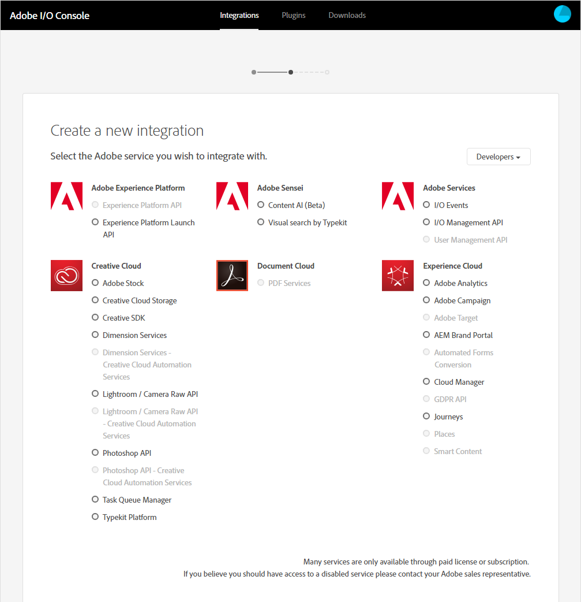

# Integrations

Through the Adobe I/O API Gateway, Adobe makes much of the power of many of its products and technologies avialable to the developer to integrate into their own applications. An _integration_ is a mechanism for your application to communicate with Adobe APIs. You create integrations in the Adobe I/O Console. 

## Authentication and Authorization

Access to Adobe APIs is granted by the Adobe I/O API Gateway when your application authenticates through the Adobe Identity Management Service. When you create your integration, you will need to determine what kind of authentication your application will require:

* **API Key Integration:** Some Adobe services, such as Adobe Stock, don't need an authenticated user to access; they merely require authorization. Such services can be called _anonymously_ and typically provide consistent results regardless of the identity of the user or service making the request. For such scenarios, API Key Authorization is sufficient. See [API Key Integration](https://www.adobe.io/authentication/auth-methods.html#!AdobeDocs/adobeio-auth/master/AuthenticationOverview/APIKeyIntegration.md) in the _Adobe Authentication Developer Guide_ for more information.  

* **OAuth Integration:** Most Adobe services require that your application be authorized by your user to access their APIs. For such scenarios, your application sends your user to an Adobe login screen, where your user logs in: your user's client credentials are then used to pass back to your application an authorization token that enables your app to access Adobe APIs on behalf of your user. This is called [OAuth Authentication](https://www.adobe.io/authentication/auth-methods.html#!AdobeDocs/adobeio-auth/master/AuthenticationOverview/OAuthIntegration.md), for which you will find more information in the _Adobe Authentication Developer Guide._

* **Service Account Integration:** For some scenarios, your application needs to authenticate on its own behalf, or on behalf of an organziation. In these scenarios, there is no user present. Instead of having a user log in and grant your application the authorization to access Adobe services, your application gets its own authorization by means of passing a JSON Web Token (JWT) and receiving an access token to be used to access Adobe APIs. For more information, see [Service Account Integration](https://www.adobe.io/authentication/auth-methods.html#!AdobeDocs/adobeio-auth/master/AuthenticationOverview/ServiceAccountIntegration.md) in the _Adobe Authentication Developer Guide._

## Types of Integrations

Your application can integrate with Adobe in one of three ways:

* **Access an API:** In this type of integration, your application makes calls to Adobe services by means of the REST API. Each Adobe product or technology makes its APIs available through the Adobe API Gateway. To find out what APIs are provided by the service you want to use, check for [APIs on adobe.io](https://www.adobe.io/apis.html).

* **Receive near real-time events:** With this type of integration, your application integrates with Adobe I/O Events to receive notifications of real-world events taking place in Adobe services, such as Creative Cloud Assets. With this type of application, you register a webhook, to which Adobe I/O Events sends HTTP POST requests containing the details of each event. This way, you can build event-driven applications that integrate with Adobe. For more information, see the [Adobe I/O Events documentation](https://www.adobe.io/apis/experienceplatform/events/documentation.html).

<!--
* **Deploy serverless actions:** (beta) This type of integration lets you post functions to Adobe I/O Runtime, a serverless function platform. Functions posted on Runtime are known as **actions.** Once you have posted your functions as actions, you can access them over the web and enjoy virtually unlimited scalability and availability without having to manage servers. For more information, see [Adobe I/O Runtime on adobe.io](https://www.adobe.io/apis/experienceplatform/runtime.html). 
-->

## Prerequisites for Integration

Depending on the type of integration you create and the type of authentication it requires, you may need the following information:

| Item | Description |
|---|---|
| Name | A unique and descriptive name for your integration. |
| Description | A short description of your integration. |
| Platform | Your choice of platform: iOS, Android, or the Web. |
| Redirect URI | When your application authenticates on behalf of a user, this is the URL to which your application's user will be redirected once they've completed Adobe authentication (see [Authentication and Authorization](#authentication-and-authorization)). This needs to point back to your own application. The URL you supply will be a default, to which Adobe will fall back if the authentication request fails; you'll supply a specific redirect URI along with your authentication requests. |
| Redirect URI pattern | This is a URL template that Adobe uses to validate the proposed redirect URIs you provide with authentication requests. Any redirect URI you submit must follow this pattern. |
| Webhook

## Creating an Integration in Adobe I/O Console

Once you know what kind of authentication your application requires and how you want to integrate with Adobe, you can create an integration for your application in Adobe I/O Console. 

1. Log in to the [Adobe I/O Console](https://console.adobe.io) and select **Integrations.**  

      
      
      The Adobe I/O Console supports two roles for creating integrations: _administrators_ and _developers._ Developers can see all integrations created by their organization, delete or edit the properties of integrations they themselves have created, and create new integrations. Administrators, in addition to this, can add or remove developers and edit or delete any integration.

2. Select **New Integration**. You'll be offered the choice of integration type. Select the type of integration you want and then select Continue.  
    
     

3. Choose the Adobe product or technology with which you want to integrate. (For serverless functions, this is skipped.) Many Adobe products and technologies require an enterprise account; depending on the ones your organization has subscribed to, your list of available choices may vary.  
    
     