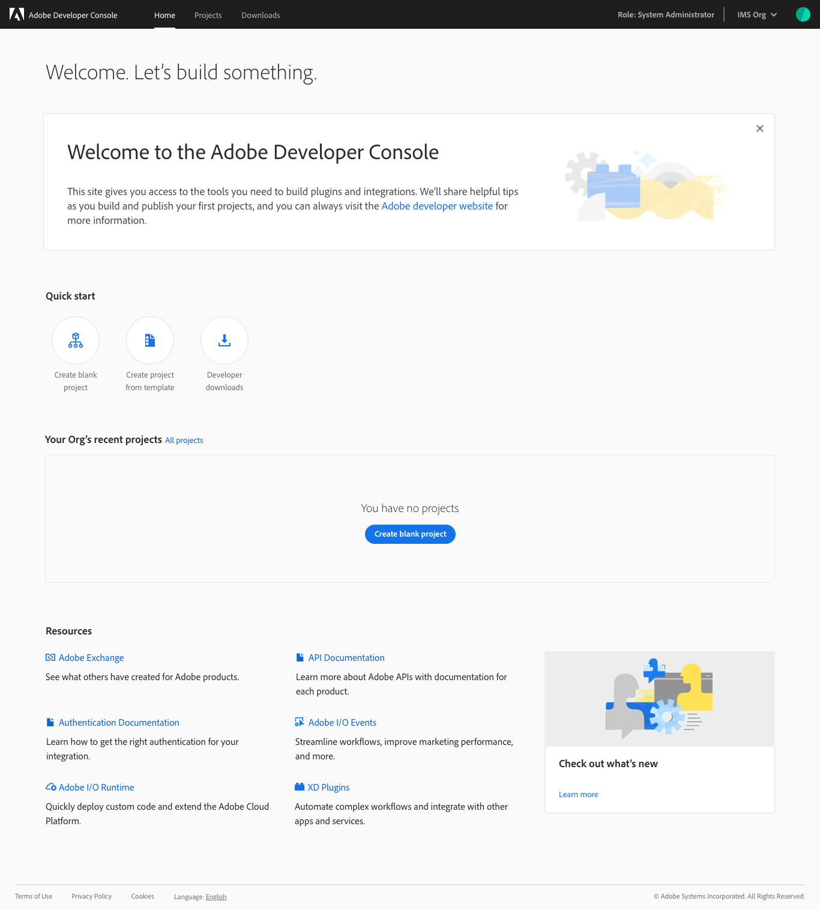

# Welcome to the new Adobe Developer Console

The new Adobe Developer Console allows you and your team to flexibly and easily connect to Adobe services, enable I/O Runtime, and manage your projects with new insights. 

Here are some of the exciting updates to Adobe Developer Console:

## Integrations and plugins are now projects
    
Save time and effort by creating projects that help you organize your work (APIs, event-based integrations, runtime, and XD plugins) and quickly get your credentials. Read the [projects overview](projects.md) to learn more.

## Create projects for you or your company  
    
Keep work and play separate. Quickly navigate between personal projects and your organization's projects through the "profile switcher" that is always available in the top right corner of Console. To learn more, read the [projects overview](projects.md).

## Introducing templates

Templated projects include everything you need to get to "hello, world" faster. To begin, read the [projects overview](projects.md).

## Deploy your project with the Project Firefly template

The Project Firefly template provides all of the developer tools you need to build Single Page Applications with Adobe's UI toolkit, create microservices, and orchestrate APIs in Adobe Experience Cloud. Collaborate with your team in dedicated workspaces and deploy to your organization seamlessly. 

## New features for Adobe XD plugin distribution

Plugin distribution is easier than ever. You can now save a draft of your submission and preview it in XD before submitting. Want approval but not ready to publish? You can now submit and delay the publishing until you are ready. To get started, read the [plugins overview](plugins.md).

