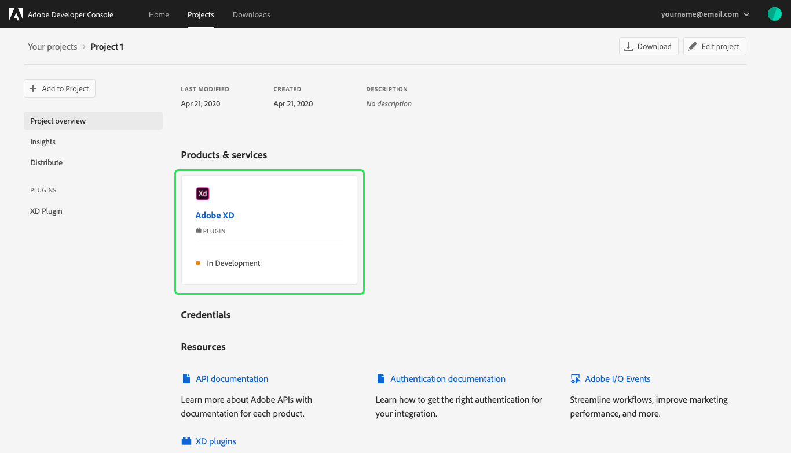
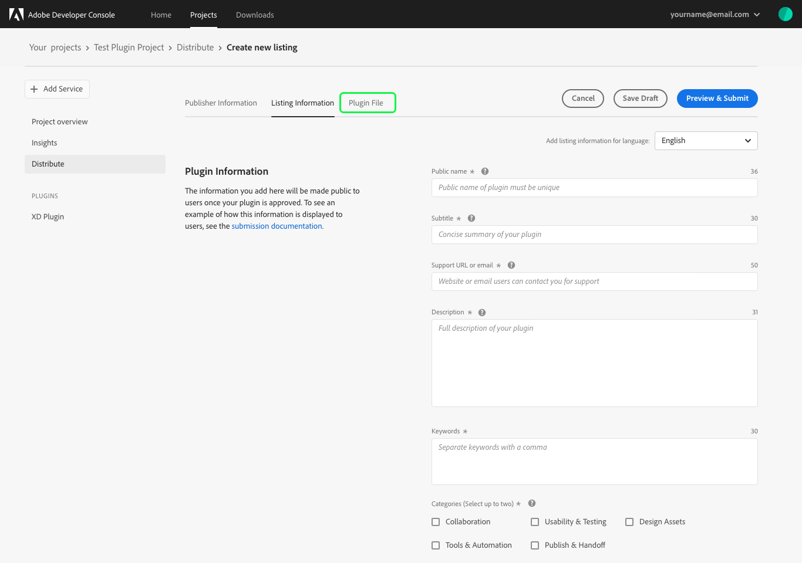
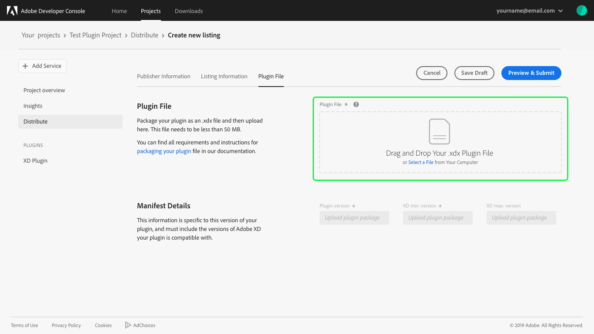
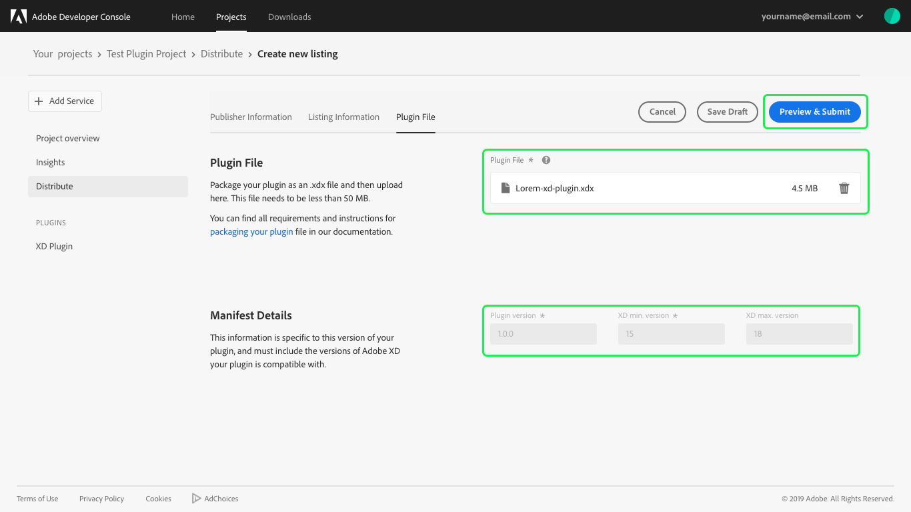

# Distribute an XD Plugin

This guide provides step-by-step instructions for distributing an XD Plugin created in Adobe Developer Console.

For information on how to begin building a plugin, please see the [Create an XD Plugin](plugin-project.md) guide.

> **Note:** XD plugins are currently only available to create as personal projects. This feature will be available to enterprise organizations soon.

## Select project

When you have finished developing your XD Plugin, it is time to submit the plugin for review and distribution. To begin, select your XD Plugin project from your list of projects in your personal organization.

## Project overview

Selecting the project opens the *Project overview* that provides information about the project including the *Last Modified* date, *Created* date, and *Description* you provided when creating the project.

Under *Products & services* you can confirm that this is an Adobe XD plugin and its status is currently "In Development".

## Distribute

To begin the distribution process, select **Distribute** from the left navigation in order to open the *Distribute* tab.

This tab includes *Resources* to help you with the distribution process, as well as an overview of the steps required to publish your XD Plugin. These steps include:

1. **Gather your files.** Ensure that you have all of the information and files needed for submitting your plugin before beginning the publishing process. You are also strongly encouraged to read the [Submission Checklist](https://adobexdplatform.com/plugin-docs/distribution/submission-checklist.html) and follow the [Submission Guidelines](https://adobexdplatform.com/plugin-docs/distribution/how-to-submit-to-plugin-manager.html) to make the process as smooth as possible.
2. **Create your listing.** During the submission process you will be asked to outline important information about your plugin, including metadata.
3. **Submit.** Once you submit your plugin, it is added to the review and approval queue. This can take up to 10 business days. Once the plugin has been approved and published you will be notified. You will also be notified if your plugin is declined for any reason so that you may fix the problem and resubmit.
  > **Note:** Making changes to your plugin after it has been submitted will result in your plugin being re-submitted and moved to the end of the approval queue.

## Create listing

Once you have gathered your files, you're ready to create your listing. To get started, select **Create Listing** from the top-right corner of the *Distribute* screen.

### Publisher Information

To begin creating your listing, you will need to provide *Publisher Information* including the *Publisher name* and *Publisher website*. A name is required and it can be yours our your company's. The website is optional and should be the URL where users can learn more about your plugin.

> **Note:** The information provided will be public to users once your plugin is approved for distribution.

Once you have added your *Publisher Information*, select **Add Listing Information** to continue.

### Listing Information

The *Listing Information* form includes the details related to your plugin, including the categories it should be listed in, languages in which it is available, and version details (in the event that you later decide to release an update to your plugin).

This is also where you are able to upload plugin icons and screenshots to improve your plugin listing. Once you have completed all of the required fields, you can continue with your plugin submission by selecting **Upload Plugin File** at the end of the *Listing Information* form or by selecting **Plugin File** from the top navigation.

### Plugin File

After ensuring that your plugin is packaged as a .xdx file, you can drag and drop your plugin file to begin uploading or use **Select a File** to navigate to the appropriate file and select it for upload.

Once the plugin file has been successfully uploaded, the name of the .xdx file will appear in the *Plugin File* field and the manifest will populate the *Plugin version* (Required), *XD min version* (Required), and *XD max version* (Optional). 

>**Note:** You are required to include the versions of Adobe XD that your plugin is compatible with, that is why *XD min version* is a required field.

You can now select **Preview & Submit** to preview your listing and submit your plugin for approval.

### Preview and submit

The final step in the distribution process is to preview your plugin and submit it for approval. Before submitting, you can preview your listing in the Adobe XD Plugin Marketplace by selecting **Preview in Adobe XD**.

You can also add a *Note to Adobe Reviewers*, such as login information that may be required in order to properly review your plugin.

You also have the option to *Delay Publishing* to a later time. By default the plugin will *Publish immediately after approval*, but you can select to *Manually publish later*.

>**Note:** If you select to manually publish your plugin later, it may take a few moments to see your plugin live in the plugin manager once you manually publish it.

After reviewing your plugin listing, adding notes to Adobe reviewers, and selecting your publishing time, you can **Submit** your plugin for review.

## Plugin review

Upon successful submission on your Plugin, you will return to the **Distribute** page where the *Version Number* ("v0.0.1"), *Status* ("In Review"), and other details of your submitted plugin are now available. 

*Distribute* now also displays **+ Add new version** in the top-right corner of the screen. 

>**Note:** Adobe Developer Console supports versioning for plugins, but attempting to add a new version while the current plugin is "In Review" will result in a "Plugin already in review" warning. Any new versions that are submitted will replace the version currently in review, moving your submission to the back of the reviewal queue. To lear more about versioning, see the [plugin update documentation](plugin-update.md).

## Next steps

Plugin submissions are reviewed by Adobe and a response is provided within 10 business days. Once your plugin has been approved, it will be published and available for installation in the XD plugin manager (unless you selected to publish your plugin manually at a later date). 

Now that you have successfully created and distributed an XD plugin, you can repeat the creation and distribution steps to create additional plugins or you can update an existing plugin by submitting a new version for review. To learn more, refer to the documentation for [updating an existing plugin](plugin-update.md).

For additional information such as resources and best practices for marketing your XD plugins, please refer to this [Adobe XD Plugin Documentation](https://adobexdplatform.com/plugin-docs/).