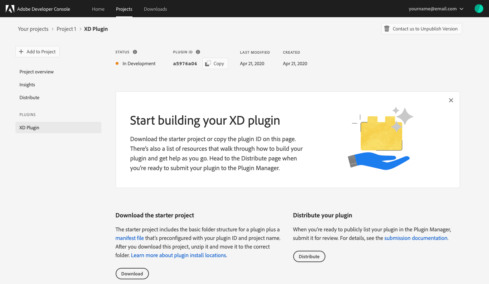

# Create an XD Plugin

This guide provides step-by-step instructions for creating an XD Plugin in Adobe Developer Console.

> **Note:** With the latest release of Adobe Developer Console, XD Plugins are now created as part of a project. XD Plugin Projects are only able to be made using your personal organization. This workflow is not available from within an enterprise organization.

## Create an empty project

To begin creating an XD plugin project, navigate to your personal organization using the org switcher in the top-right corner of the UI. 

From within your personal organization, select the quick start button to **Create an empty project**.

When the project overview opens, it will briefly display a success banner ("Project created successfully").

## Begin building your plugin

Select **Add XD Plugin** to add a new plugin to your project.

Once the plugin is created, you will be taken to the landing page for your plugin. This landing page includes the *Status*, *Plugin ID*, *Last modified*, and *Created* date for your plugin, as well as navigation options to return to the *Project Overview*, view *Insights*, or *Distribute* your completed plugin.

### Download starter project

To begin development for your plugin, select **Download starter project** from the top-right corner of the console. 

The starter project includes the basic folder structure for a plugin as well as a manifest file that is pre-configured with the correct plugin ID and project name.

## Project overview

At any time you can return to the *Project overview* by selecting it in the left navigation. The overview includes information about the plugin project, including *Products & services* which lists the Adobe XD Plugin that you created. While you continue to work on your plugin it will appear as "In Development".

## Next steps

When you have finished building your XD Plugin, it is time to submit the plugin for review and distribution. For detailed instructions on how to submit your plugin for distribution through Adobe Developer Console, please see the [plugin distribution](plugin-distribution.md) guide.