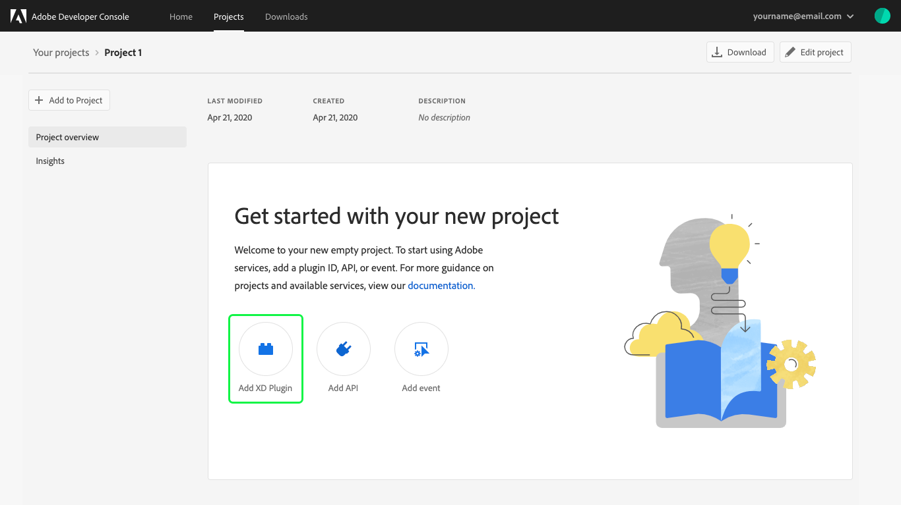
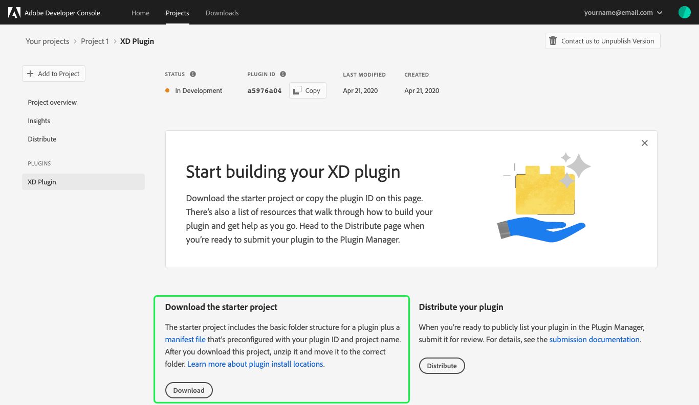

# Create an XD Plugin

This guide provides step-by-step instructions for creating an XD Plugin in Adobe Developer Console.

> **Note:** With the latest release of Adobe Developer Console, XD Plugins are now created as part of a project. XD Plugin Projects are only able to be made using your personal organization. This workflow is not available from within an enterprise organization.

## Create a blank project

From within your personal organization, select the quick start button to **Create blank project**.

When the project overview opens, it will briefly display a success banner ("Project created successfully") and you will then be able to select **Add XD Plugin** to begin working on your plugin.

## Begin building your plugin

Once the plugin has been created successfully, you will be taken to the landing page for your plugin. This landing page includes the *Status* and *Plugin ID* for the Plugin, as well as navigation options to view a *Project Overview*, review plugin *Insights*, or *Distribute* your completed plugin.

### Download starter project

To begin development for your plugin, select **Download starter project** from the top-right corner of the console. 

The starter project includes the basic folder structure for a plugin as well as a manifest file that is pre-configured with the correct plugin ID and project name.

## Plugin overview

## Next steps

When you have finished building your XD plugin, it is time to submit the plugin for review and distribution. For detailed instructions on how to submit your plugin for distribution through Adobe Developer Console, please see the [plugin distribution](plugin-distribution.md) guide.