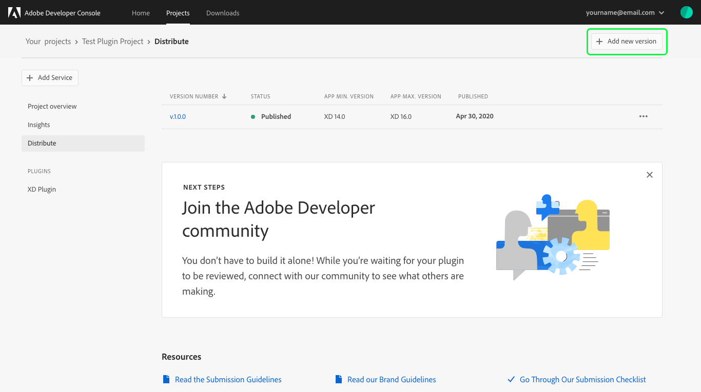
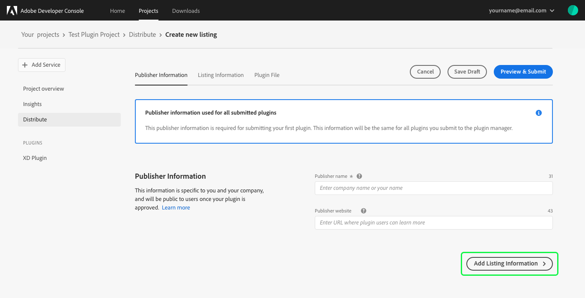
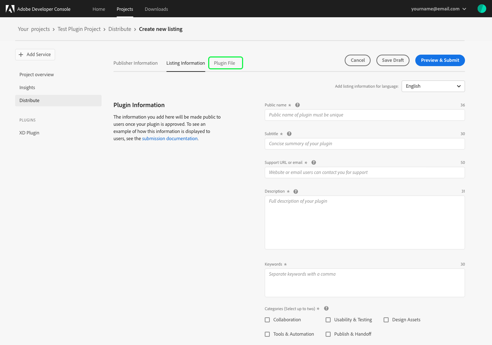
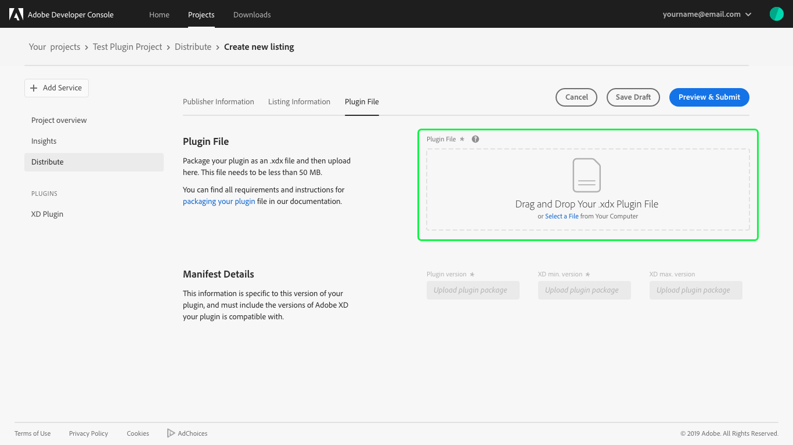
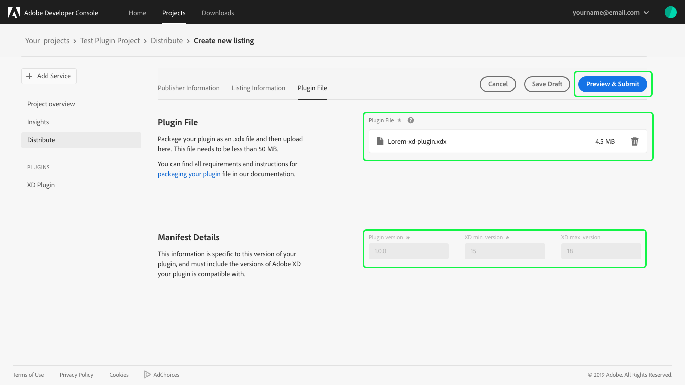
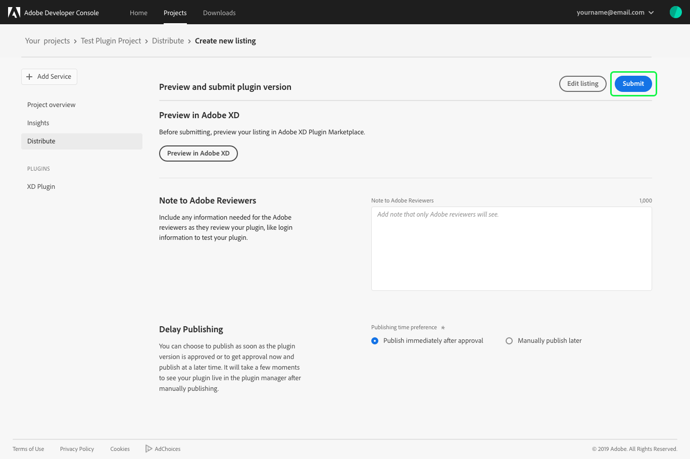
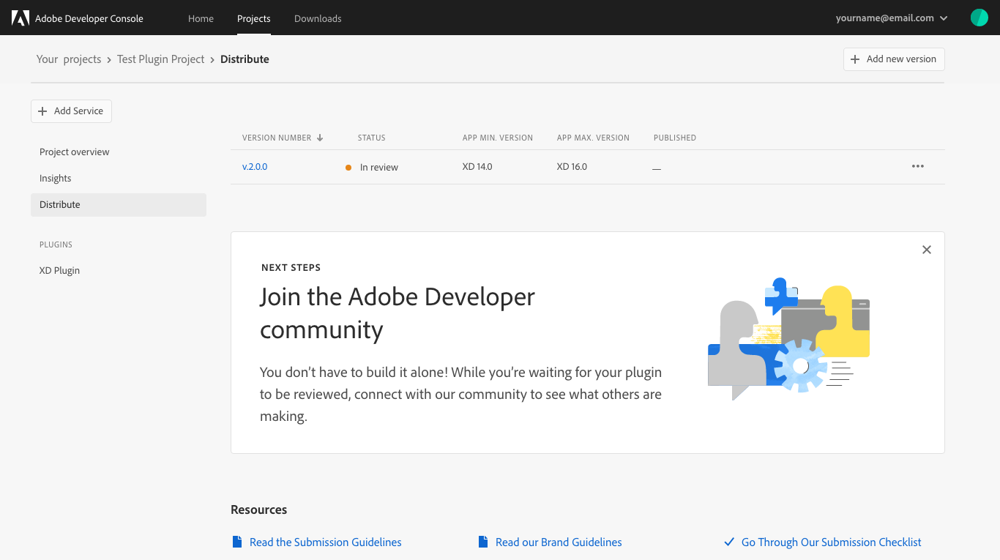

# Update an XD plugin

Adobe Developer Console supports versioning of XD plugins, allowing you to continue development on your existing plugin and release an updated version for users. 

## Add new version

To submit a new version of your XD plugin for review, return to the *Project overview* for your plugin project and select **Distribute** from the left navigation.

On the *Distribute* tab, you will see details pertaining to your current plugin, including *Version Number*, *Status*, and *Published* date.

To begin adding a new version, select **Add new version** in the top-right corner of the console screen.

## Update listing information

At this time you can update fields related to your plugin listing, including the  *Publisher Information* such as the *Publisher name* and *Publisher website*. Remember that the name is required and it can be yours our your company's. The website is optional and should be the URL where users can learn more about your plugin.

> **Note:** The information provided will be public to users once your plugin is approved for distribution.

You can also update the *Listing Information*, including the categories your plugin should be listed in, languages in which it is available, and version details for your new plugin version.

## Plugin file

After ensuring that your listing has been updated properly, you can drag and drop your new .xdx plugin file or use **Select a File** to navigate to the appropriate file on your computer and select it for upload.

Once the plugin file has been successfully uploaded, the name of the .xdx file will appear in the *Plugin File* field and the manifest will populate the new *Plugin version* (Required), *XD min version* (Required), and *XD max version* (Optional). 

>**Note:** You are required to include the versions of Adobe XD that your plugin is compatible with, that is why *XD min version* is a required field.

You can now select **Preview & Submit** to continue.

### Preview and submit

The final step in the distribution process is to preview your plugin and submit it for approval. Before submitting, you can preview your listing in the Adobe XD Plugin Marketplace by selecting **Preview in Adobe XD**.

You can also add a *Note to Adobe Reviewers*, such as login information that may be required in order to properly review the new version of your plugin.

You also have the option to *Delay Publishing* to a later time. By default the plugin update will *Publish immediately after approval*, but you can select to *Manually publish later*.

>**Note:** If you select to manually publish your plugin later, it may take a few moments to see your plugin live in the plugin manager once you manually publish it.

After reviewing your plugin listing, adding notes to Adobe reviewers, and selecting your publishing time, you can **Submit** the new version of your plugin for review.

## Plugin review

Upon successful submission on your Plugin, you will return to the **Distribute** page where the *Version Number* will have updated to the new version of your plugin, and the *Status* will once again be "In review".

## Next steps

Plugin submissions are reviewed by Adobe and a response is provided within 10 business days. Once your plugin has been approved, it will be published and available for installation in the XD plugin manager (unless you selected to publish your plugin manually at a later date). 

Now that you have successfully created and distributed an XD plugin, you can repeat the creation and distribution steps to create additional plugins or create other applications using Adobe Developer Console. To learn more about creating projects within console, please begin by reading the [projects overview](projects.md).

For additional information such as resources and best practices for marketing your XD plugins, please refer to this [Adobe XD Plugin Documentation](https://adobexdplatform.com/plugin-docs/).