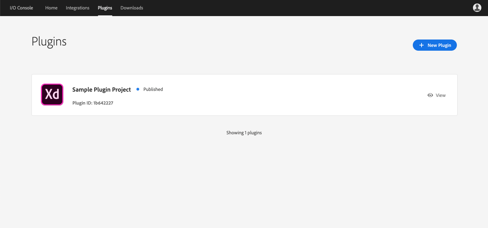
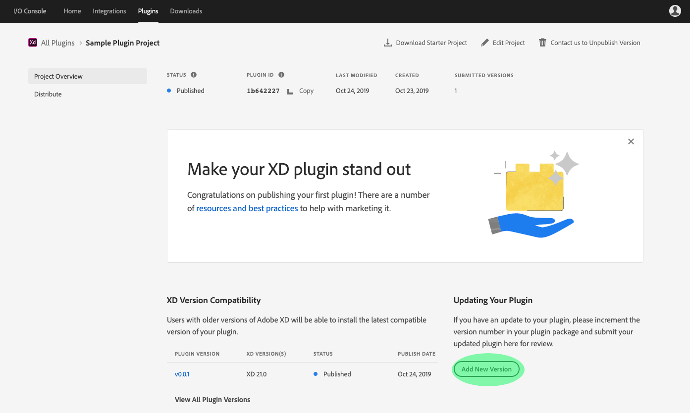
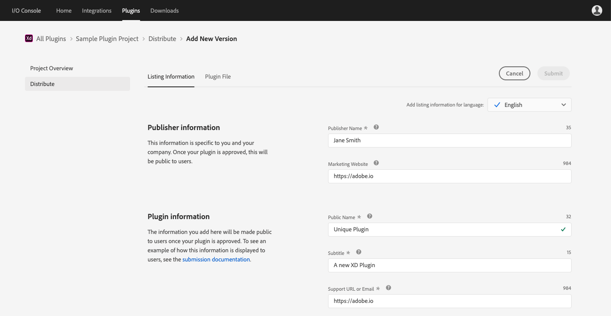
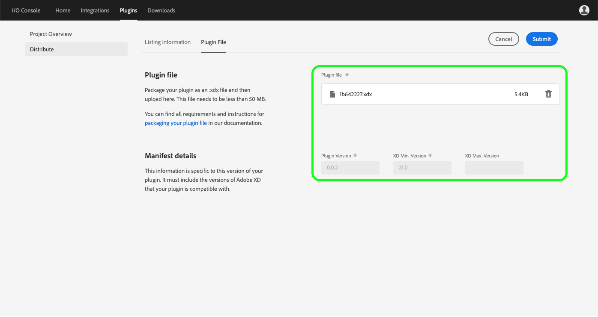
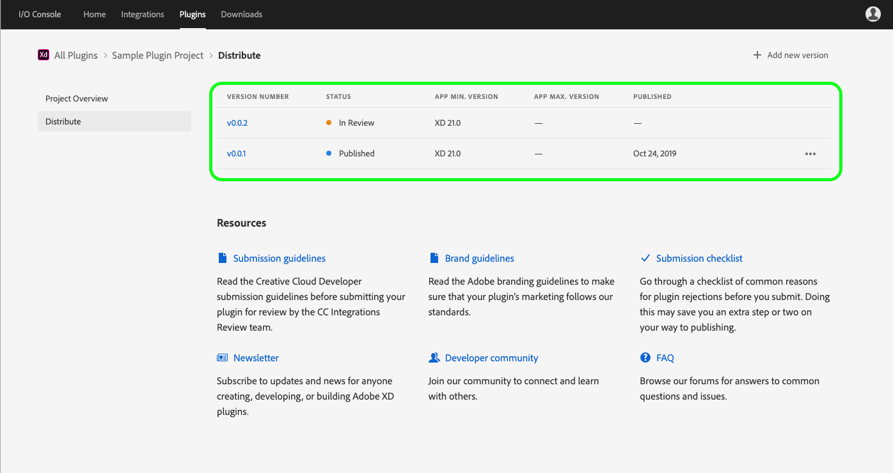

# Update an XD plugin

Adobe I/O Console supports versioning of XD plugins, allowing you to continue development on your existing plugin and release an updated version to the XD plugin manager. Versioning is done through Adobe I/O Console by completing the following steps:

1. Return to the project overview for your published XD plugin by logging in to [Adobe I/O Console](https://console.adobe.io), clicking **Plugins** in the top navigation, and then selecting the plugin you wish to view. If multiple plugins are visible, confirm that the "Plugin ID" matches the plugin you wish to update.

    

2. From the Project Overview, click **Add New Version** to begin the versioning process.

    

3. On the **Listing Information** tab, you can update details related to your plugin, including updating screenshots and release notes or adding additional categories, keywords, or languages.

    

4. When the **Listing Information** tab is updated, click **Upload plugin file** to view the **Plugin File** tab. From here, you can drag and drop or browse your computer in order to upload your updated plugin file. Your plugin should be packaged as an .xdx file and needs to be less than 50 MB in order to upload successfully. 

    Once uploaded, the plugin file will appear in the "Plugin file" field and the "XD Min. Version", and "XD Max. Version" (if provided) fields will auto-generate based on the details provided in your manifest file. The "Plugin Version" field is populated as well, and should be an incremented version from the previous plugin. If the plugin file details are correct,click **Submit** to continue.

    

5. On the **Distribute** page for your plugin, you should now see an entry for the new version of your plugin, including the "Version Number" (v0.0.2), "Status" (In Review), and other details.    

    

6. The new version of your plugin is then reviewed and you will receive a response within 10 business days. Once your updated plugin has been approved, the new version will be published and available for installation in the XD plugin manager.