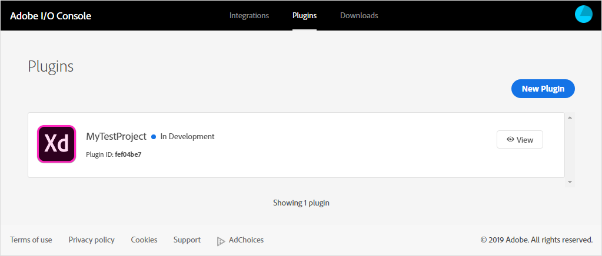
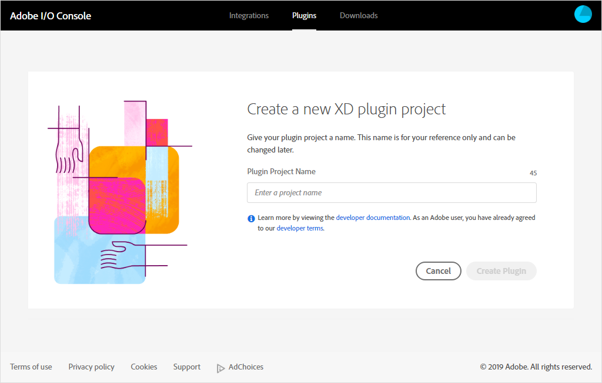
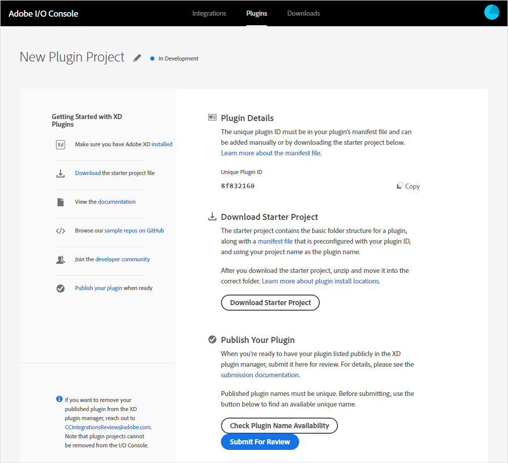

# Plugins

The Adode I/O Console enables you to plugins for Adobe XD, Adobe's interactive prototyping tool. XD plugins extend the capabilities of Adobe XD by adding new features to the app, automating workflows, connecting the app to external services, and more.

To create an XD plugin:

1. Log in to [Adobe I/O Console](https://console.adobe.io) and select **Plugins.** This opens the Plugins screen, where you can create new plugins and see any existing plugins you've already created.  
    
     

2. Select **New Plugin.** The "Create a new XD Plugin project" screen appears.  
    
     

3. Enter a name for your plugin and select **Create Plugin.** Before you do, make sure about the name, because plugin projects can't be deleted from within Adobe I/O Console. You'll see the plugin project details screen.  
    
    

From here, you can copy the plugin's unique ID to be included in your manifest file; download the starter project, which you can use as a model for your own; and once you're ready, submit your plugin for review. You'll have to make sure your plugin's name is unique. For more information, check the [Adobe XD Plugin Documentation](https://adobexdplatform.com/plugin-docs/).