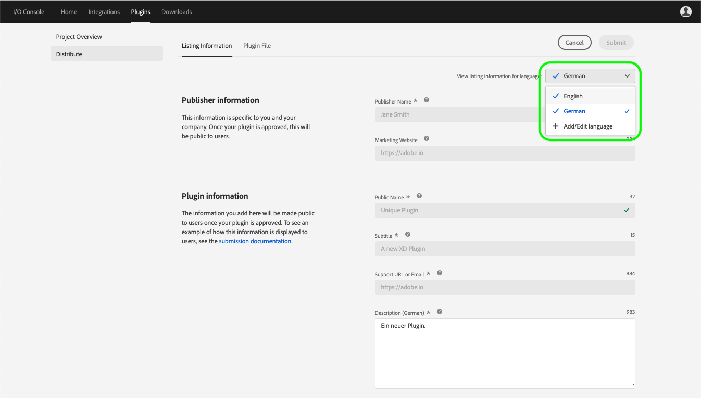
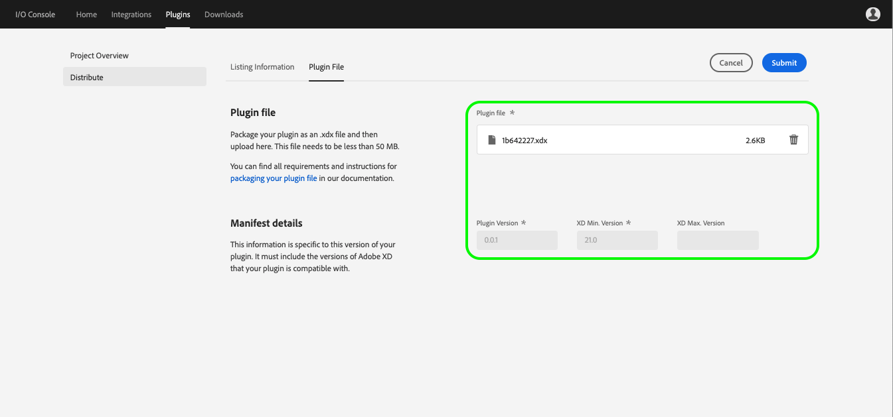
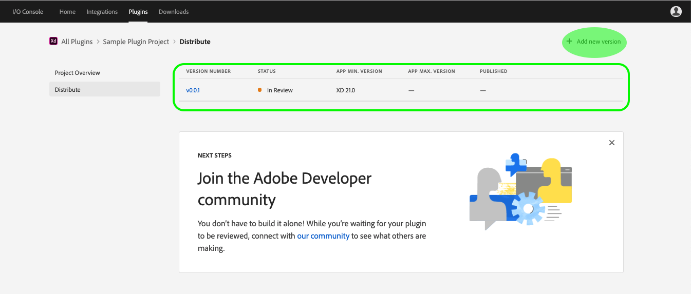

# Plugins

The Adode I/O Console enables you to create plugins for Adobe XD, Adobe's interactive prototyping tool. XD plugins extend the capabilities of Adobe XD by adding new features to the app, automating workflows, connecting the app to external services, and more.

## Create an XD plugin project

To assist you in building your own Adobe XD plugins, Adobe provides a starter project containing a helpful model that you can adapt as your own. In order to access the starter project, you must first create a new plugin within Adobe I/O Console by completing the following steps:

1. Log in to [Adobe I/O Console](https://console.adobe.io) and select **Plugins** from the top navigation.

    

2. The Plugins screen displays any existing plugins that you have already created. Click **New Plugin** to begin creating a new plugin.
    
     

3. The "Create a new XD plugin project" dialog opens, requiring you to provide a name for your new plugin. An auto-generated name is provided for you, or you may create your own. This name is for reference only and you are able to change the project name later. Once you have entered a name for your plugin project, click **Create**.
    
     

4. The **Project Overview** contains the details of your newly created plugin. To begin building your XD plugin, download the starter project by clicking **Download**. The starter project includes the basic folder structure for a plugin as well as a manifest file that is preconfigured with the correct plugin ID and project name.
    
    

## Distribute an XD plugin

When you have finished building your XD plugin, it is time to submit the plugin for review and distribution. The following steps outline how to submit your plugin for distribution through Adobe I/O Console.

1. Return to the project overview for your new XD plugin by logging in to [Adobe I/O Console](https://console.adobe.io), clicking **Plugins** in the top navigation, and then selecting the plugin you wish to view. If multiple plugins are visible, confirm that the "Plugin ID" matches the plugin you wish to distribute.

    

2. From the Project Overview, click **Distribute** to begin the review and distribution process.

    

3. On the **Listing Information** tab, you are required to fill in details for "Publisher information" and "Plugin information" as well as provide icons and screenshots for your plugin. There are tooltips provided along the way to assist with the information that should be entered in each field. Hover over the question mark (?) next to each field name in order to view the tooltip. 

    

4. Adobe I/O Console allows you to add a listing for your plugin in multiple supported languages. To begin, click the "Add listing information for language" dropdown and select **Add language**.

    

5. The "Choose Additional Languages" dialog opens, allowing you to select languages for which you would like to add localization for parts of your listing. The added language support will show in the XD plugin marketplace to users that have that language as a default in their system.

    Once you have selected the necessary languages, click **Save**.

    

6. Currently only the plugin "Description" field supports localization. Upon returning to the listing information, you will be required to provide a new description in each of the languages that you selected. 

    Once you have successfully entered the descriptions, check marks will appear next to the languages. You will not be able to submit a plugin without adding a description for each additional language selected.

    

7. When the **Listing Information** tab is complete, click **Upload plugin file** to view the **Plugin File** tab. From here, you can drag and drop or browse your computer in order to upload your plugin file. Your plugin should be packaged as an .xdx file and needs to be less than 50 MB in order to upload successfully. 

    Once uploaded, the plugin file will appear in the "Plugin file" field and the "Plugin Version", "XD Min. Version", and "XD Max. Version" (if provided) fields will auto-generate based on the details provided in your manifest file. If you are happy with the uploaded file and manifest details, click **Submit**.

    

8. On the **Distribute** page for your plugin, you should now see the "Version Number" (v0.0.1), "Status" (In Review), and other details of your submitted plugin.    

    

    > Note: Once you have submitted your plugin, "Add new version" appears in the top-right corner of the screen. Adobe I/O Console supports versioning for plugins, but attempting to add a new version while the current plugin is "In Review" will result in a "Plugin already in review" warning and any new versions will replace the version currently in review, moving your submission to the back of the reviewal queue.

    

9. Your plugin submission is now being reviewed by the integrations team and you will receive a response within 10 business days. Once your plugin has been approved, it will be available for installation in the XD plugin manager.

<!-- 
## Add new plugin version

If you would like to make an update to an existing XD plugin, you can do so through Adobe I/O Console by completing the following steps. -->

## Next steps

Now that you have successfully created and distributed an Adobe XD plugin, you can repeat the above steps to create additional plugins or [connect with the Adobe Developer community](https://adobexdplatform.com/plugin-docs/community.html) to see what others are making.

For additional information, including resources and best practices for marketing your XD plugins, please visit the [Adobe XD Plugin Documentation](https://adobexdplatform.com/plugin-docs/).