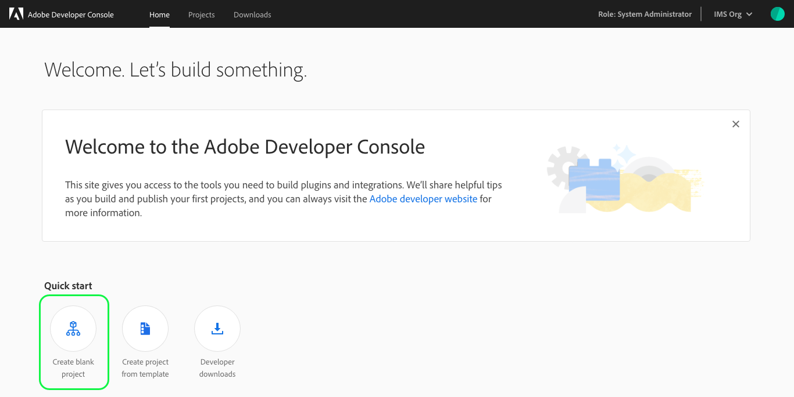

# Create a blank project

This guide provides step-by-step instructions for creating a blank project in Adobe Developer Console.

If you were hoping to create a project using a template, please follow the steps in the [templated project guide](template-project.md).

## Select organization

Before creating a project, ensure that you are working in the correct organization. To view and select an organization, use the organization switcher located in the top-right corner of the console.

## Quick start

Next, select **Create blank project** from the _Quick start_ menu on the _Home_ screen.

> **Note:** When accessing console using a personal organization, only two Quick start options appear: "Create blank project" and "Developer downloads".

## Project overview

After selecting to create a blank project, the _Project Overview_ screen opens, showing the details of your project and an alert confirming that a project has been created successfully.

A project name is automatically generated for your project ("Project 12" in the top-right corner of the screen) and is an internal name that can be edited using the **Edit** button.

> **Note:** When creating multiple projects within an organization or working collaboratively with other developers, it is best practice to choose a project name that is descriptive and makes it easy to distinguish your project from others.

The _Project Overview_ screen also includes the last modified date of the project, the project created date, and the project description.

With the blank project created, you can begin to add services using the **Add Service** button on the left-side of the screen or the quick action buttons provided in the center of the screen.

## Next Steps

To begin working with services, including steps for adding APIs, events, and enabling Runtime, please start by reading the [services documentation](add-services.md).
