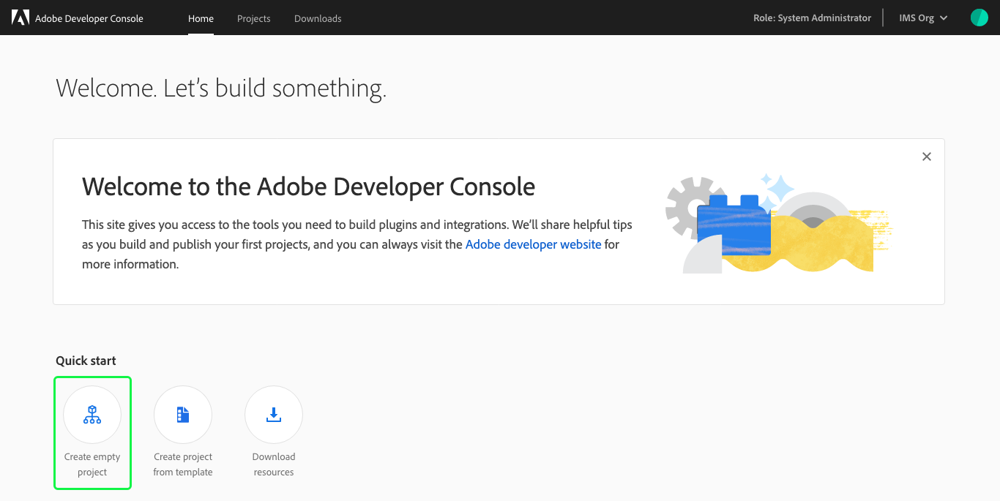
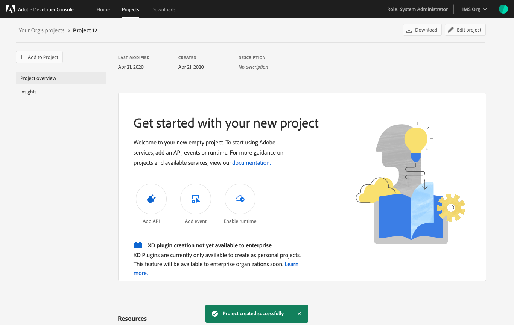
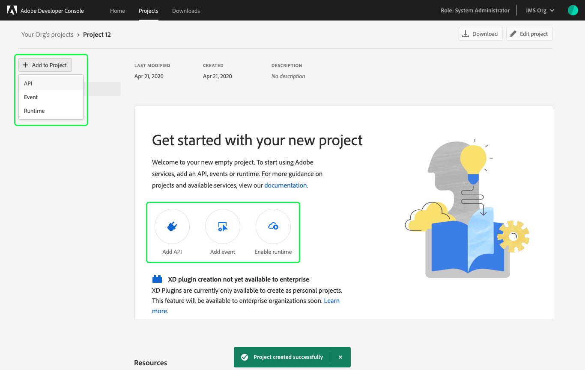

# Create an empty project

This guide provides step-by-step instructions for creating an empty project in Adobe Developer Console.

> **Note:** If you were hoping to create a project using a template, please follow the steps in the [templated project guide](template-project.md).

## Select organization

Before creating a project, ensure that you are working in the correct organization. To view and select an organization, use the organization switcher located in the top-right corner of Console.

## Quick start

Next, select **Create empty project** from the _Quick start_ menu on the _Home_ screen.

> **Note:** When accessing Console using a personal organization, only two Quick start options appear: "Create empty project" and "Developer downloads".

## Project overview

After selecting to create an empty project, the _Project Overview_ screen opens, showing the details of your project and an alert confirming that a project has been created successfully.

A project name is automatically generated for your project ("Project 12" in the top-left corner of the screen) and is an internal name that can be edited using the **Edit project** button.

> **Note:** When creating multiple projects within an organization or working collaboratively with other developers, it is best practice to choose a project name that is descriptive and makes it easy to distinguish your project from others.

The _Project Overview_ screen also includes the last modified date of the project, the project created date, and the project description.

## Next Steps

With the empty project created, you can start using Adobe services, adding APIs, adding events, and enabling Runtime using the **Add to Project** button on the left-side of the screen or the quick action buttons provided in the center of the screen.

To learn more about working with services including steps for adding APIs, events, and runtime, please begin by reading the [services overview](services.md).

