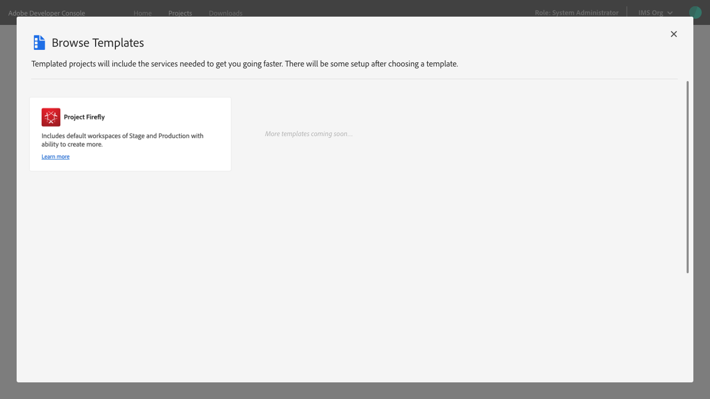
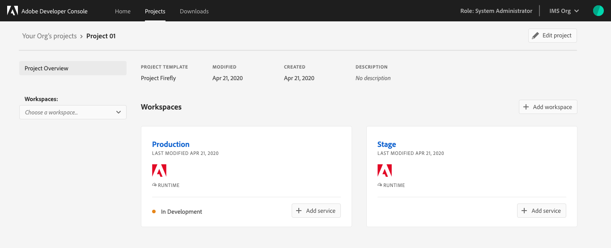

# Create a templated project

In order to streamline the creation of projects, Adobe Developer Console provides templates that you can use to get up and running quickly.

This guide outlines the steps necessary to create a project using a template. 

If you do not wish to use a template and would like to create a blank project, please follow the steps in the [blank project guide](blank-project.md).

## Quick start

To begin, select **Create project from template** from the _Quick start_ menu on the _Home_ screen.

## Select template type

When the _Browse Templates_ dialog opens, you will be able to select a template type.

Currently three is one template type available: Adobe Custom Applications. This template supports you in creating a project that generates an Adobe Custom Application. 

> **Note:** Additional templates will be released in the future to support the streamlining of other workflows and creation of applications.

## Set up templated project

After a template has been selected, it is time to set up the project.

The following sections provide detailed information and best practices for setting up a new templated project.

> **Note:** Please pay special attention to the [App Name](#app-name) as this value cannot be changed once project set up is complete.

### Project title

A project title is generated automatically ("Project 01"), but you can change the title by deleting the auto-generated title and providing a new one. 

This project title is internal only and can be changed later if required.

It is recommended that if you are working in collaboration with multiple developers, you provide a project title that is meaningful and makes the project easy to distinguish from other projects in the organization.

### App Name

The app name is the public-facing name of the application and is used for setting up environments and **cannot be changed once the project is created**. It is important to consider the name of the application as it cannot be altered beyond the set up screen.

**MISSING: Best Practices for App Names**

### Workspaces

Templated projects include multiple workspaces, which can be thought of as individual working sub-folders for each developer on the project.

Two workspaces are provided automatically: Production and Stage. These workspaces cannot be edited or deleted. Since you are creating a custom application for distribution, the Production workspace is the workspace that will be used for the submission and distribution flow. This means that the application that will be used by end-users is coming out of the Production workspace.

You can also create additional workspaces for each individual developer working on the project. These workspaces are editable and can be added or deleted as needed.

### Adobe I/O Runtime

Add Runtime automatically, means each workspace gets a unique runtime namespace set up - each developer to work within their own runtime environment.  
  * If don’t do auto, can do that later, individually.
  * Can auto add and remove from each later, individually.
  * Why not auto? Use case: just UI app, no runtime behind it, give option to not have runtime set up.
  * checked by default, most use cases will include it

To learn more about Adobe Runtime, visit the [Runtime documentation](https://www.adobe.io/apis/experienceplatform/runtime/docs.html)

### Save the project

With all of the set up details complete, you can select **Save** to save your project. This opens the project overview, showing the details of your newly created project.

From the project overview you can view and select all available workspaces, as well as see the status, template, last modified date, created date, and description for the project.

## Next Steps

Now that the project is set up, you can begin to develop against it by adding services such as APIs and events.

To begin working with services, please read the [services documentation](add-services.md).

__

* Project is set up, start developing against it
    * add a service - API, Events (Runtime already enabled)
* Workspaces
    * ellipses - can edit and delete it
    * toggle between workspaces 
    * start typing and it will populate
    * click on card
* Custom apps need to go through approval process - this will show the STATUS of the project overall 
    * production workspace - In Development
    * Production workspace - drives the status for the overall project
* Within workspace - add API, add event, see runtime namespace
    * regular project view - what project looks like in other places
    * important in “custom apps” (cloud native) is the approval flow
* Make sure production workspace has code, APIs, etc that it needs and submit for approval
* Approval:
    * Production workspace, services connected
    * fill in app details - project title and app name - from initial setup
    * description will be public-facing - part of application
    * who the main contact is - company administrators know who to go back to
    * icon - dimensions required
    * leave a note for internal reviewer - reviewer is customer enterprise admin
        * custom apps - system admin getting approval request from developer who built the app
        * different approval flow and XD go to ADOBE REVIEWERS
        * for now, goes to company administrators for approval - for custom/cloud native apps
    * Either Rejected or Approved.
        * See note if rejected and go make changes
        * STATUS: Published
* How apps built in backend is runtime focused - just getting credentials in console
    * container, runtime namespace, etc in GitHub — don’t doc this.