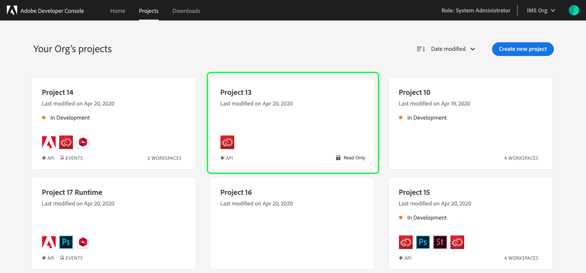

# Projects overview

All development work in Adobe Developer Console is done as part of a project. A project may include one or multiple products, as well as a combination of APIs, events, runtime, and XD plugins. 

## Personal vs enterprise projects

Projects are a common framework within both personal and enterprise organizations. Projects belonging to an enterprise organization are visible to other members of the organization, whereas projects belonging to a personal organization are visible only to the individual to whom the organization belongs.

Use the organization switcher to view the organizations to which you belong and easily switch between them.

> **Note:** For enterprise organizations, you must be a system administrator or developer in order to create projects for your organization. For information on how to manage developers in the admin console, see the [managing developers documentation](https://helpx.adobe.com/enterprise/using/manage-developers.html).

## Empty projects

Think of an empty project as an open canvas or "blank slate" from which you can add events, runtime, plugins, APIs, and more to create custom applications.

> **Note:** XD Plugins are currently only able to be created as personal projects.

To get started, follow the steps provided in the guide for [creating an empty project](projects-empty.md).

## Templated projects

In order to streamline the creation of projects, Adobe Developer Console provides templates that you can use to get up and running quickly. 

> **Note:** Templated projects are currently only available for enterprise organizations.

To get started, follow the steps provided in the guide for [creating a templated project](projects-template.md).

## Read Only view

As a member of an enterprise organization, you may not have been granted access to all of the services licensed by your organization. For this reason, you may see a *Read Only* tag on certain projects or workspaces within a templated project.

Projects or workspaces marked as *Read Only* are still visible to you, but certain actions, such as downloading, editing, copying client secrets, or initiating the approval workflow will be greyed out and inaccessible to you.

If you believe you are seeing a *Read Only* tag in error, or would like to gain access to certain services and product profiles, please work with your organization's administrators for access.

## Deleting a project

Projects can only be deleted if they do not contain a Runtime namespace. If needed, you can create a new project and start again but you cannot delete a project once Runtime has been added to it. 

You can make edits to an existing project, including removing APIs and event registrations, but you cannot delete Runtime namespaces therefore you cannot delete projects containing a Runtime namespace. For more information on working with services within a project, please begin by reading the [services overview](services.md).