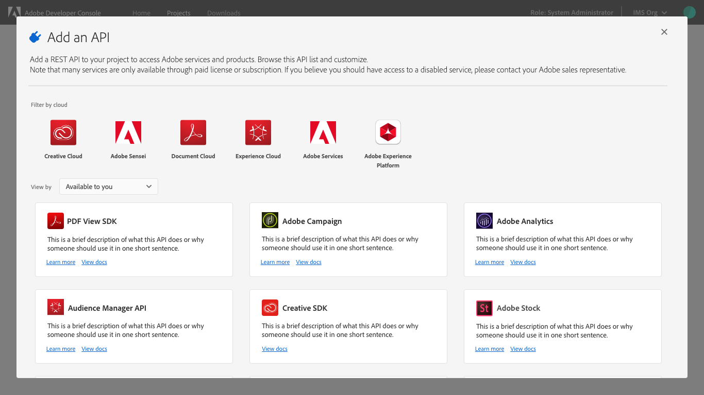
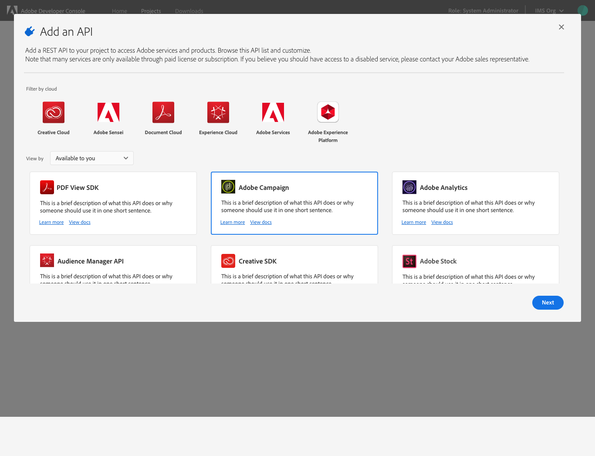
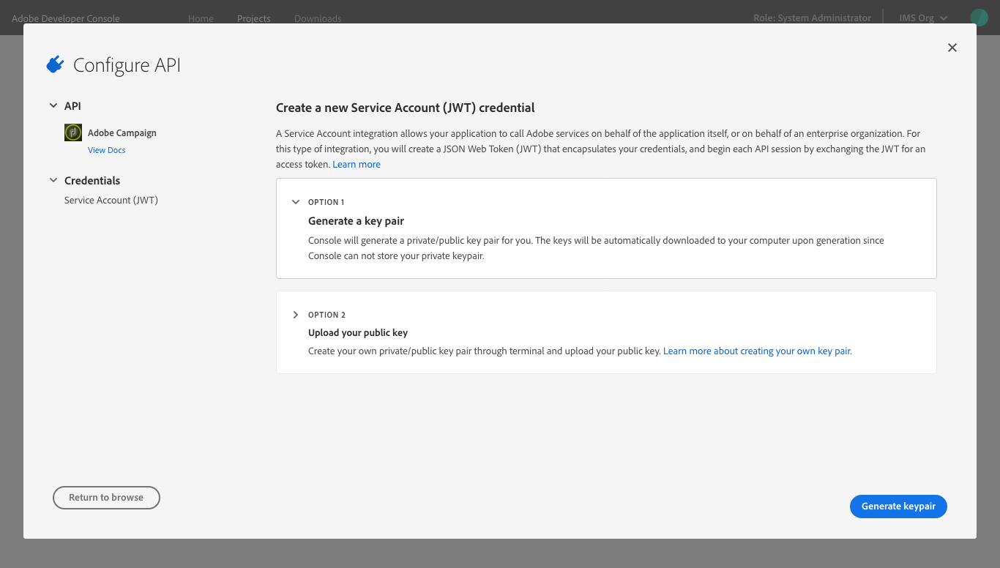
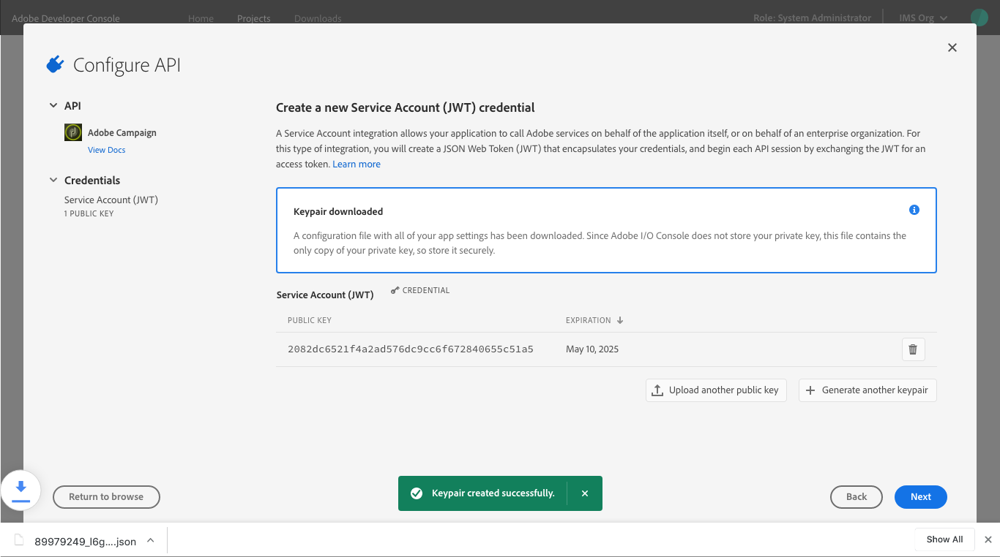
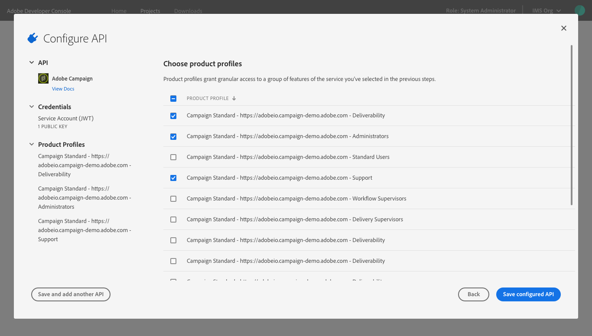
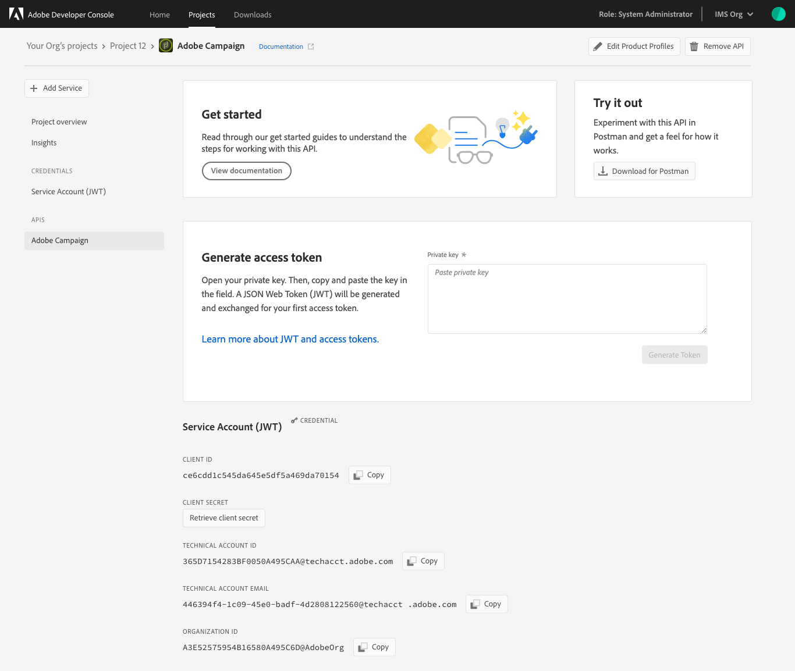
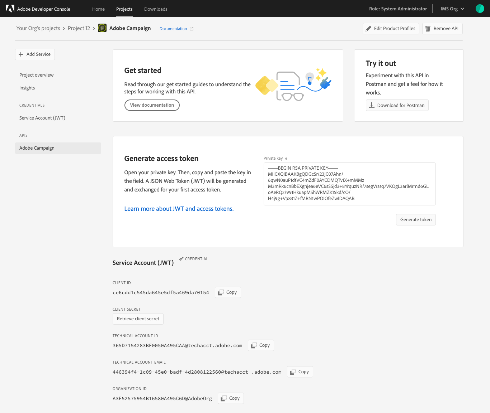
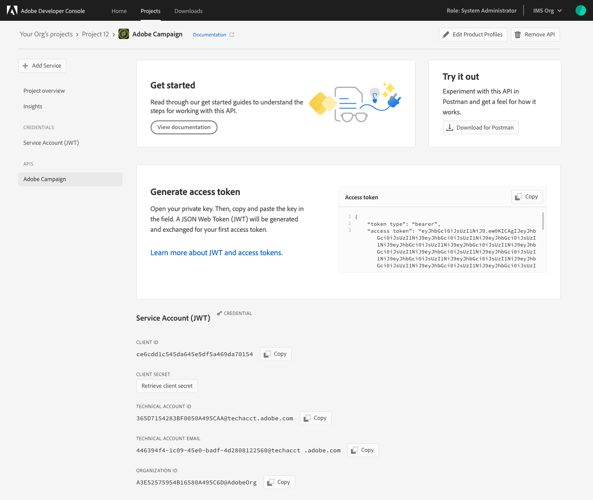

# Add API to project using JWT

Adding an API to an empty project is the same whether you are working in a personal or enterprise project. Adding an API to a templated project is similar, with one small variation: APIs are added to individual workspaces, not to the project as a whole.

To begin adding an API from within a templated project, first select the appropriate workspace to open the *Workspace overview*. Then, select **+ Add Service** in the left navigation and choose **API** from the dropdown. 

In an empty project, select **+Add to Project** in the left navigation of the *Project overview* and then choose **API**, or select **Add API** from the quick start buttons.

## Add an API

Using REST APIs allows your application to make calls to Adobe services and products. The *Add an API* dialog shows a list of available services with the default *View by* setting to show only those services available to you.

> **Note:** Many services are only available through paid licenses or subscriptions. Licenses and subscriptions can refer to either your organization or your personal licenses if you are building a personal project. For this reason, if you select "All" from the *View by* dropdown, you may notice that several services appear greyed out in the list. If you believe that you should have access to one of these disabled services, please speak with your system administrator or Adobe sales representative.

## Credentials

Now that you have added an API, you can return to the *Project overview* (or *Workspace overview* in a templated project) at any time to view the details for that API and any other project services you may have added. 

You can select the specific API from the left navigation to view its details or remove the API using the **Remove API** button in the top-right corner.

You can also select the specific credential type from the left navigation to view the *Credential details* and perform other actions (generate JWT tokens, copy credential details, retrieve client secrets, etc.) as needed. For more information on accessing credentials, please read the [credentials overview](credentials.md).

## Next steps

With an API successfully added, you can follow the same workflow steps to add additional APIs, or return to the [services overview](services.md) to select another type of service to add to your project.

If you have completed development on your project and are ready to submit your application for approval, please read the [project approval process guide](approval.md) to get started.