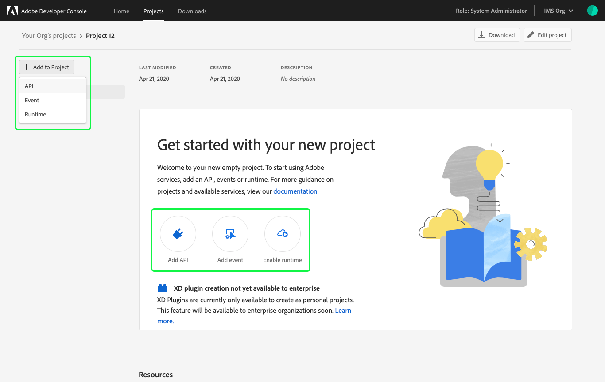
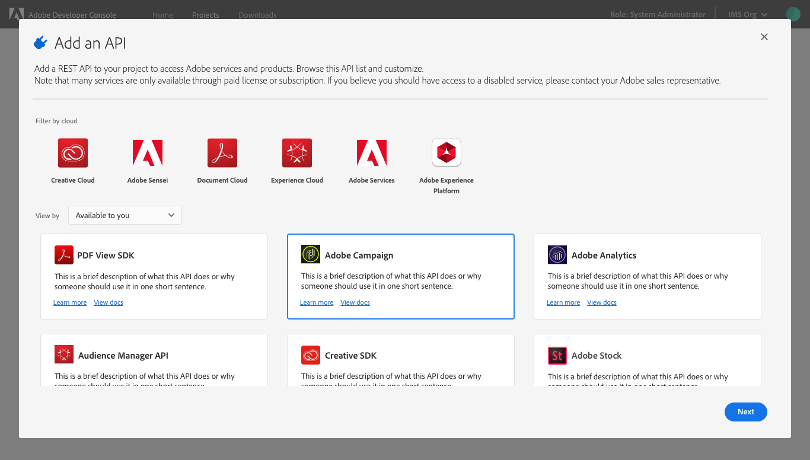
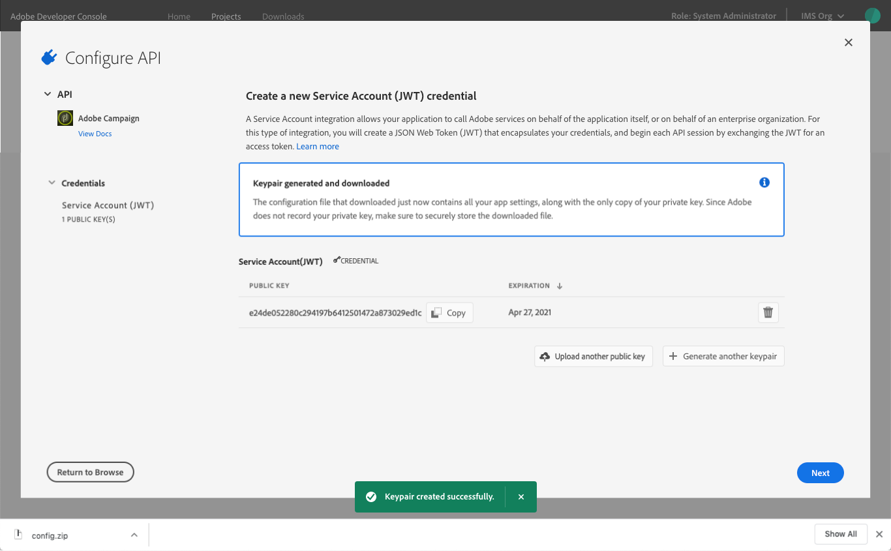

# Add API to project using JWT

Adding an API to an empty project is the same whether you are working in a personal or enterprise project. Adding an API to a templated project is similar, with one small variation: APIs are added to individual workspaces, not to the project as a whole.

To begin adding an API from within a templated project, first select the appropriate workspace to open the *Workspace overview*. Then, select **+ Add Service** in the left navigation and choose **API** from the dropdown. 

In an empty project, select **+Add to Project** in the left navigation of the *Project overview* or select from the quick start buttons.

Using APIs allows your application to makes call to Adobe services by means of a REST API.

Access to some APIs is based on licenses. Meaning either the licenses your company holds or your personal licenses if you are building a personal project. Due to this you may not have access to every API that you wish to use.

