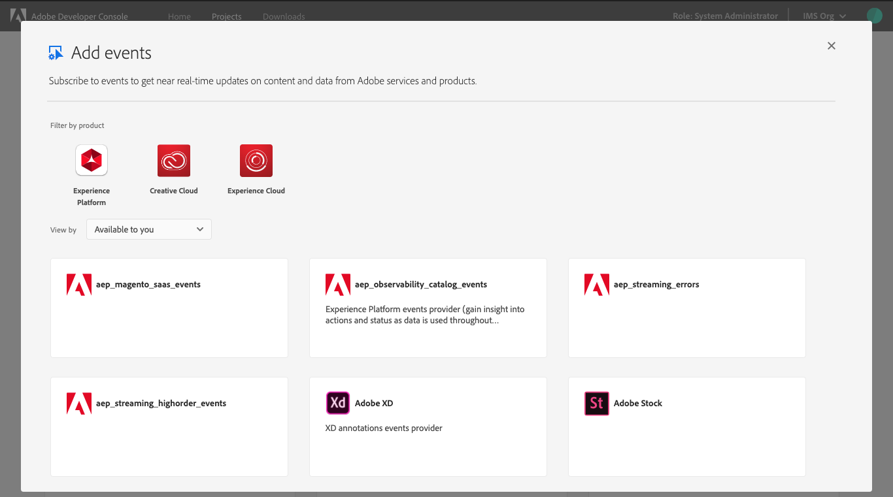
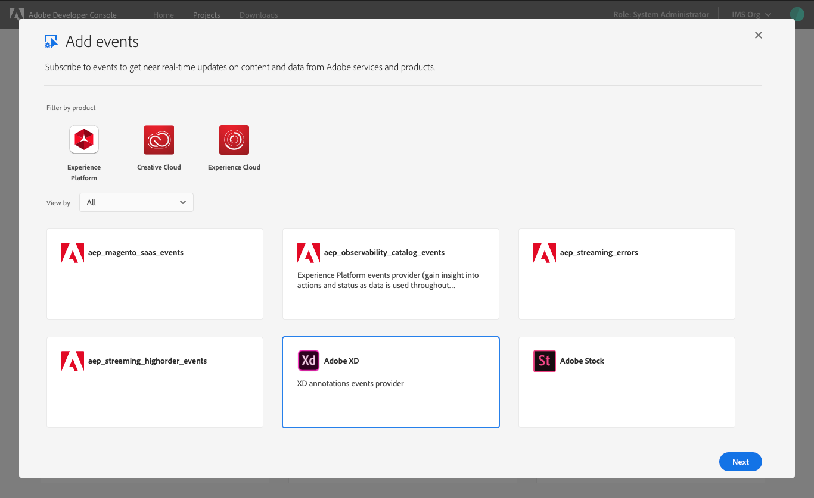
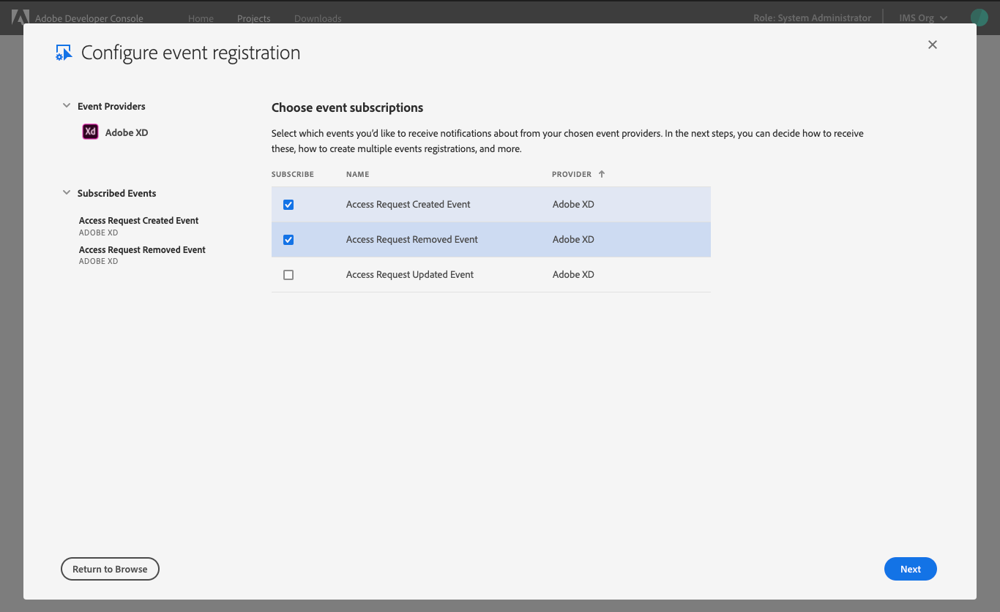
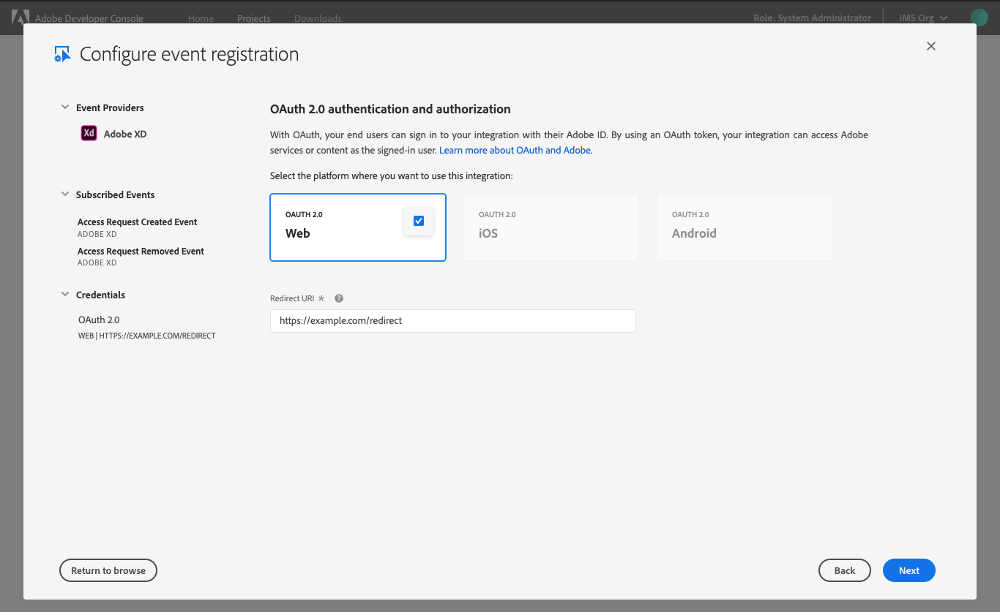
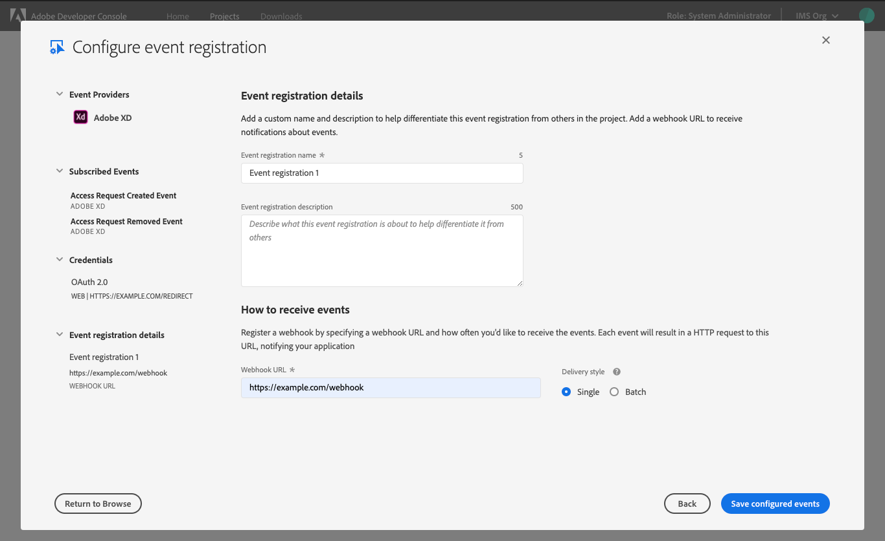
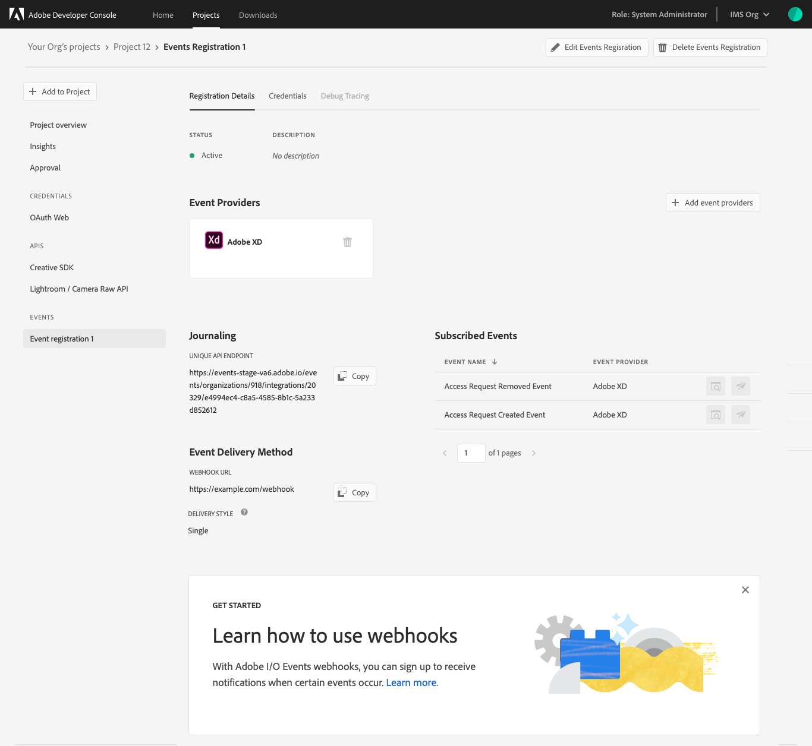
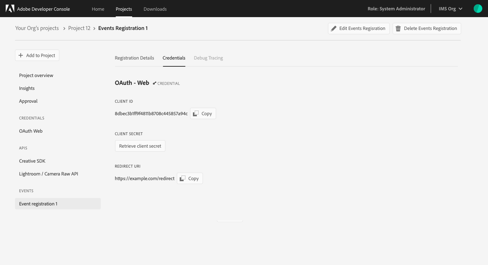
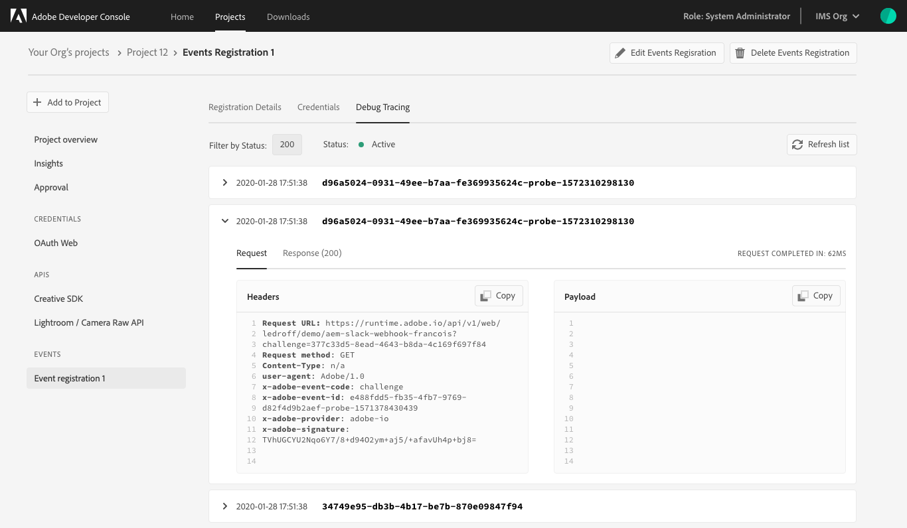

# Add Events

## Configure

## Registration details

## Credentials

## Debug Tracing

## Next steps

Now that you have successfully added events to your project or workspace, you can follow this workflow again to add additional event registrations, or return to the [services overview](services.md) to select another type of service to add to your project.

If you have completed development on your project and are ready to submit your application for approval, please read the [project approval guide](approval.md) to get started.