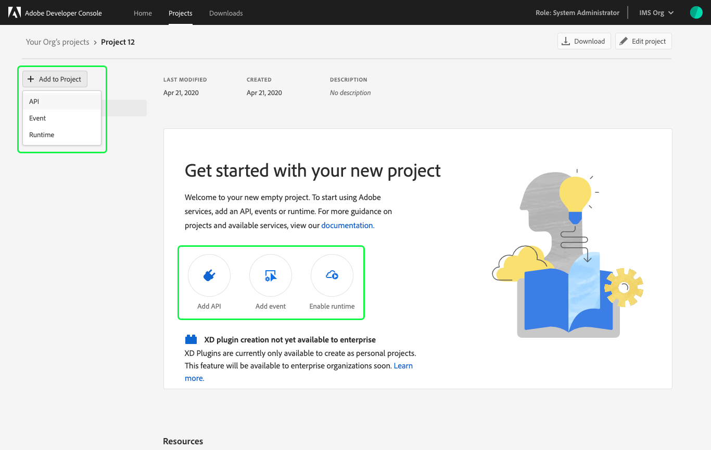

# Services overview

After creating a project, it is time to begin adding services. These services include accessing Adobe APIs, adding events, and enabling Runtime.

> **Note:** If you are looking to build an XD Plugin, please visit the [plugins overview](plugin-project.md) for a complete guide to creating, updating, and distributing plugins.

## Add a service

Adding services to an empty project is the same whether you are working in a personal or enterprise project. Adding services to a templated project is similar, with one small variation: services are added to individual workspaces, not to the project as a whole.

To begin adding a service from within a templated project, first select the appropriate workspace to open the *Workspace overview*. Then, select **+ Add Service** in the left navigation and choose the service you wish to add from the dropdown. 

In an empty project, select **+Add to Project** in the left navigation of the *Project overview* or select from the quick start buttons.

## Service-specific workflows

To follow a specific workflow for adding each type of service, please select from the following guides:

### Add API

Using APIs allows your application to makes call to Adobe services by means of a REST API.

Access to some APIs is based on licenses. Meaning either the licenses your company holds or your personal licenses if you are building a personal project. Due to this you may not have access to every API that you wish to use.

APIs can be added in multiple ways, depending on API and/or the type of app you are building. Occasionally APIs will provide multiple connection options, allowing you to choose the type of connection that works best for your application.

* [Add an API using JWT](services-add-api-jwt.md)
* [Add an API using OAuth](services-add-api-oauth.md)
* [Add an API using an API Key](services-add-api-key.md)

### Add Event

Adobe I/O Events all you to receive notifications of real-time events taking place in Adobe services. To add this service to your project you must register a webhook, to which Adobe I/O Events sends HTTP POST requests containing the details of each event. Using Events, you can build event-driven applications that integrate with Adobe.

* [Add Event](services-add-events.md)

### Enable Runtime

Adobe I/O Runtime is Adobe’s serverless computing platform. Runtime enables you to execute functions from the cloud without deploying or configuring a server. This ability provides a flexible, on-demand computing resource that lets you easily access Adobe content, data, and services, orchestrate custom workflows, and respond to events from Adobe I/O Events to create powerful event-driven applications.

> **Note:** Adobe I/O Runtime is only available for enterprise customers and requires a license. Please contact your Adobe sales representative for more details.

* [Add Runtime](services-enable-Runtime.md)

## Credentials

Once you have successfully added APIs to your project or workspace, you can return to the *Project overview* (or *Workspace overview* in a templated project) at any time to view the details for that API and any other project services you may have added. 

You can select the specific API from the left navigation to view its details or remove the API using the **Remove API** button in the top-right corner.

You can also select the specific credential type from the left navigation to view the *Credential details* and perform other actions (generate JWT tokens, copy credential details, retrieve client secrets, etc.) as needed. For more information on accessing credentials, please read the [credentials overview](credentials.md).

To view credentials for events, select the specific event registration from the left navigation and select the *Credentials* tab. For more information on working with events, including viewing event credentials, follow the [Add Events guide](services-add-events.md).

## Insights

Adobe Developer Console automatically generates valuable insights related to API and Runtime usage for each enterprise project (or for each workspace when working in a templated project). 

API insights are also generated for personal projects, however because Runtime cannot be added to personal projects, there are no Runtime usage insights available.

To learn more about insights, read the [insights overview](insights.md).

## Next steps

You can continue to add as many services as you need by following the various [workflow guides](#service-specific-workflows) found in this document.

Once you have completed development on your project and are ready to submit your application for approval, please read the [project approval guide](approval.md) to get started.

